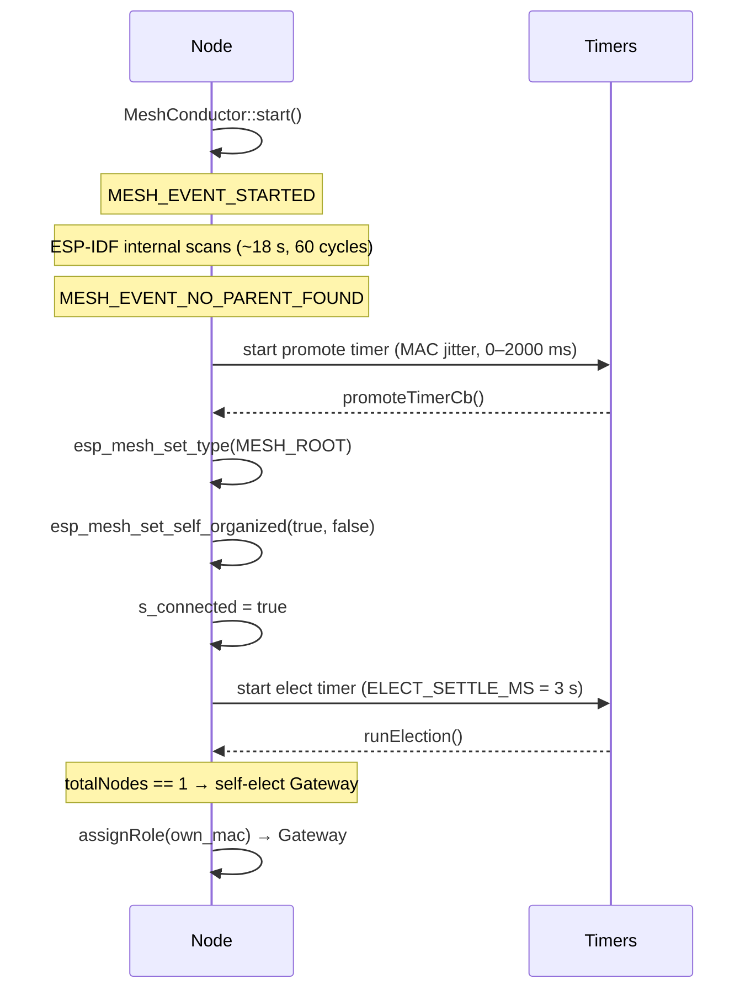
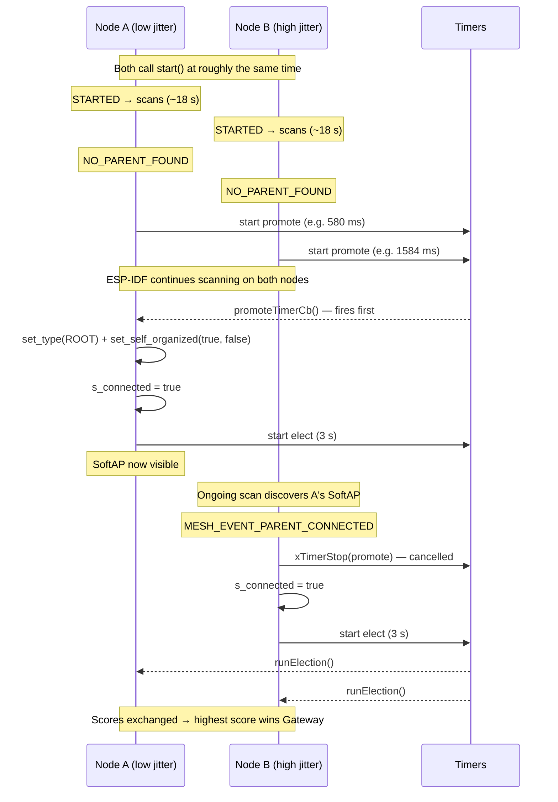
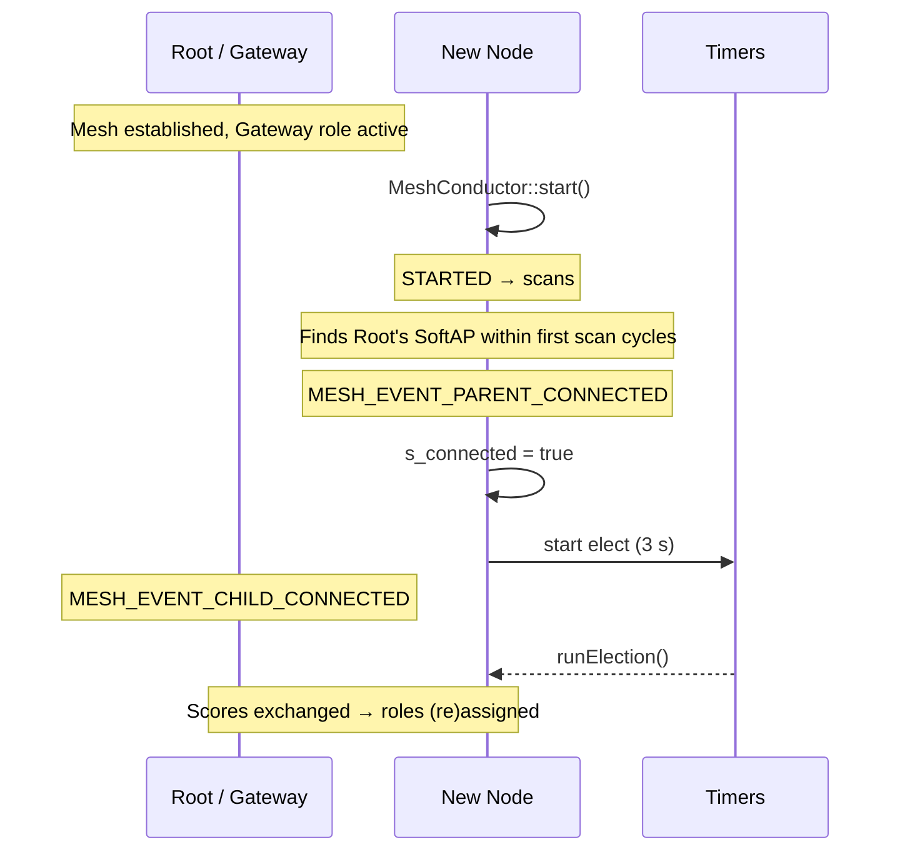
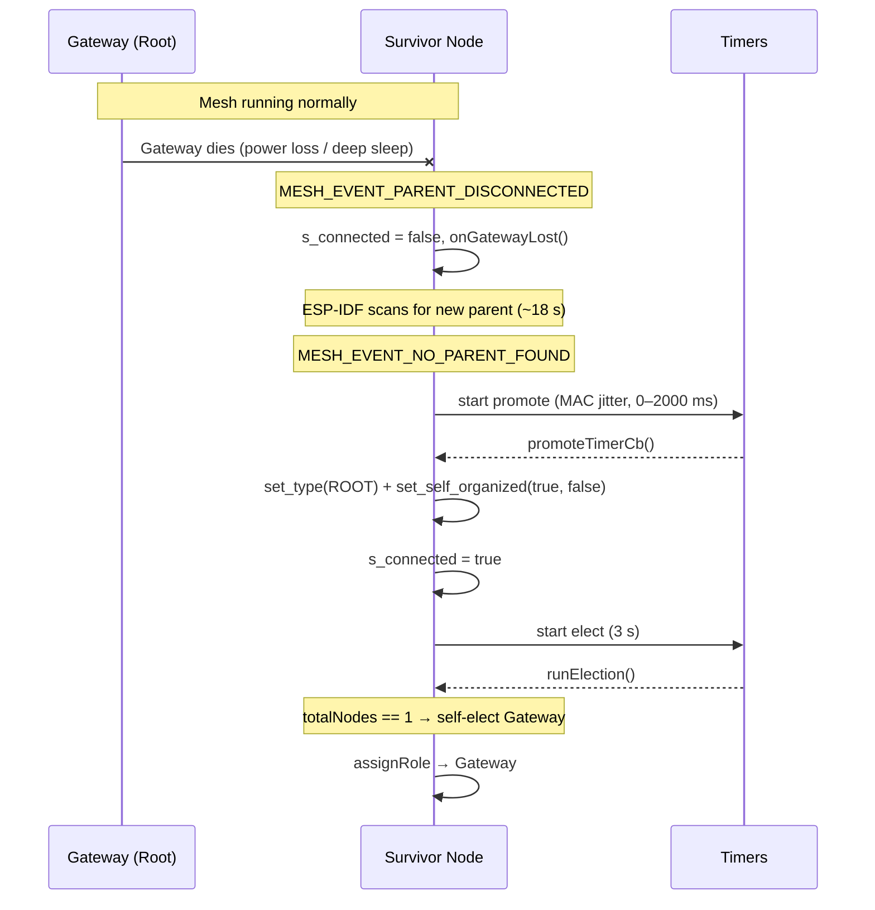
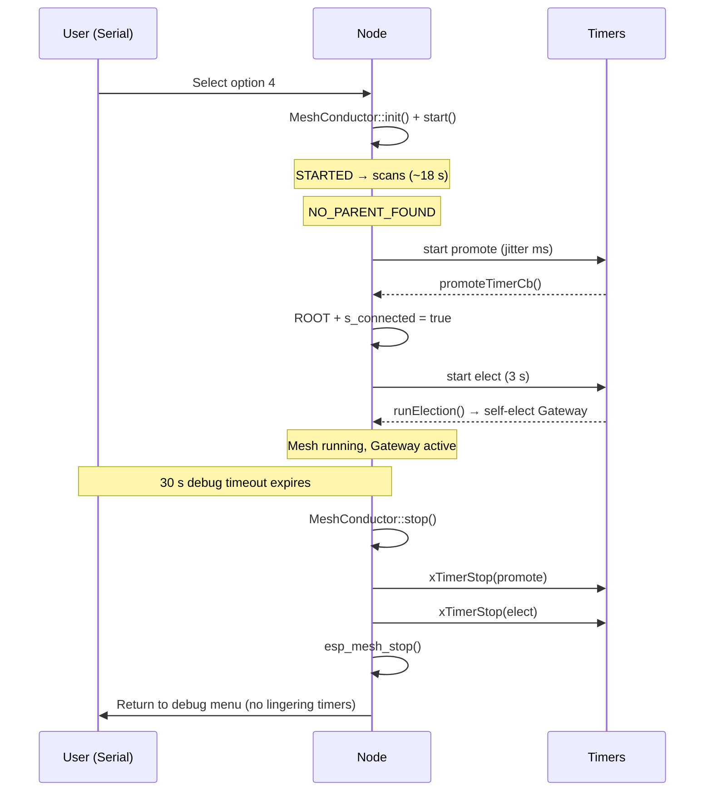

# Squeek — Functional Specification Document

## Context

Squeek is a pet toy and prank device built from a flotilla of identical ESP32-C6 SuperMini boards. The nodes form a self-healing WiFi mesh that uses FTM (Fine Timing Measurement) to determine their relative 3D positions without manual configuration. A smartphone or laptop controls the flotilla through a web UI served by an automatically elected gateway node. The spatial awareness enables sounds to "travel" across the physical space — a cat chases a squeak that runs from node to node following the real room layout.

---

## 1. Overview

**Product:** Squeek — a distributed, self-locating sound mesh
**Target hardware:** ESP32-C6 SuperMini (ESP32-C6FH4, 4MB flash, WiFi 6, FTM, RISC-V)
**Framework:** PlatformIO, dual Arduino + ESP-IDF
**Nodes:** Identical firmware, scalable from 2 to N nodes

### Board Hardware (per SuperMini)
- ESP32-C6 SoC with WiFi 6 + FTM
- 4MB flash
- USB-C connector with built-in LiPo charger IC
- Charge state LED (managed by charger IC)
- WS2812 RGB LED on GPIO8
- Simple LED on GPIO15 via 1K resistor. Defaults to blink in debug, defaults to off in release.
- LiPo battery (user-supplied)
- Piezo buzzer driven push-pull via two GPIOs (user-soldered)
- Optional: voltage divider on GPIO2 or GPIO3 for battery ADC monitoring (user-soldered)

### Imported Arduino libraries
 -  `adafruit/Adafruit NeoPixel@^1.12` for obvious purposes
 -  `https://github.com/me-no-dev/AsyncTCP.git#master` for inteactive React/Preact web pages.
 -	`https://github.com/me-no-dev/ESPAsyncWebServer.git#master` for webservices. 
 -	`paulstoffregen/Time @ ^1.6.1  ` to allow for NTP. 
 -	`sensorium/Mozzi@^2.0.2	` for sound synthesis. 

### Pin Mapping (defined in `include/bsp.hpp`)
| Symbol | GPIO | Purpose |
|--------|------|---------|
| `LED_BUILTIN` | GPIO15 | Status LED (via 1K resistor) |
| `RBG_BUILTIN` | GPIO8 | WS2812 RGB LED |
| TBD | GPIO2/3 | Battery voltage ADC (via voltage divider) |
| TBD | 2x GPIO | Piezo buzzer (push-pull, opposed phases) |


**All app-centric preprocessor defines are made in `include/bsp.hpp`.**


### Primary Use Cases
- **Pet toy** for cats, ferrets, and small predators — sounds that travel, pop up randomly, or run in triggered sequences to stimulate hunting instincts
- **Prank device** — scheduled sound triggers with stealth mode that hides the mesh from discovery

### Key Differentiator
Nodes use WiFi FTM to build a 3D spatial map of the flotilla without any manual configuration. This drives intelligent sound routing — a "chase" sequence follows the actual physical layout, not an arbitrary order.

---

## 2. Functional Requirements

### FR1 — Self-Healing WiFi Mesh
- Nodes discover each other automatically on power-up
- Mesh reforms when nodes join, leave, or lose connectivity
- No manual pairing or configuration required
- All nodes run identical firmware

### FR2 — Gateway Election
- One node is elected as gateway (serves web UI, coordinates playback, schedules FTM)
- If the gateway goes offline, another node is elected automatically
- Gateway provides a WiFi SoftAP for the controller (smartphone/laptop) to connect
- Election strategy: weighted score (battery + adjacency - tenure + MAC tiebreak), NVS-tunable weights, re-election on gateway loss (see Section 7.2)

### FR3 — FTM Self-Localization
- Nodes perform pairwise FTM ranging to estimate inter-node distances
- Gateway coordinates FTM round scheduling (non-overlapping pairs per round)
- Multiple samples per pair, averaged for precision
- Relative 3D Cartesian positions computed from distance matrix (MDS or iterative trilateration)
- Position map updates periodically; frequency configurable (battery vs. accuracy trade-off)
- Incremental updates: if a node moves, only its edges re-measured

### FR4 — Sound Playback
- **Tone synthesis** via Mozzi — procedural chirps, squeaks, warbles, melodies
- **Sample playback** — compressed audio clips (MP3) decoded via libhelix-mp3, stored in LittleFS
- **Audio output layer is modular:**
  - Phase 1: piezo buzzer, push-pull via two GPIOs (doubled voltage swing)
  - Future: I2S DAC companion board

### FR5 — Play Modes
- **Traveling sound** — sound hops across nodes following the physical 3D layout (spatial path computed by gateway)
- **Random pop-up** — random nodes emit sounds at random intervals
- **Triggered sequences** — user-defined patterns of (node, sound, delay) tuples launched from web UI
- **Scheduled triggers** — time-delayed or clock-based activation (for pranks)

### FR6 — Web UI (served by gateway)
- Upload and manage sound samples
- Visualize node topology map in 3D (from FTM data)
- Design and trigger play sequences visually
- Configure play modes, scheduling, and FTM frequency
- Battery levels per node
- Stealth mode toggle

### FR7 — Stealth Mode
- Nodes stop advertising the WiFi SoftAP
- Web UI becomes inaccessible
- Only pre-scheduled or pre-configured sequences remain active
- Exit stealth via physical reset or a pre-set timeout

### FR8 — Visual Feedback
- WS2812 RGB LED for node status (mesh state, playback activity, low battery)
- GPIO15 LED as simple heartbeat indicator
- **LEDs must be kept brief** to conserve battery — flash and off, no sustained illumination

### FR9 — Battery Monitoring
- ADC reads battery voltage via high-impedance voltage divider on GPIO2 or GPIO3
- Low-battery threshold triggers brief WS2812 warning color
- Critical-battery triggers graceful mesh departure and deep sleep
- Battery levels reported to gateway and visible in web UI

### FR10 — Node-Local Mesh Map
Each node maintains a local map of the mesh it belongs to, stored in two tiers:

**RTC Slow Memory (~8KB, survives light + deep sleep):**
- Own node ID, MAC, current role (gateway/peer)
- Gateway MAC, mesh channel, credentials
- Peer table: MAC + short ID for each known node (compact)
- Own 3D position (3 floats = 12 bytes)
- Last FTM epoch timestamp
- Mesh generation counter (detect stale data on wake)

**IRAM (full working map, when awake):**
- All peer 3D positions
- Full or partial distance matrix
- Peer status (awake/sleeping/dead/battery level)
- Current play sequence state + own role in it
- Routing hints (which peers to relay through)

---

## 3. Architecture

### System Topology

```
┌──────────────────────────────────────────────────────┐
│                   Controller                         │
│           (smartphone/laptop browser)                │
│                       │                              │
│                 WiFi SoftAP                          │
│                       ▼                              │
│   ┌──────────── Gateway Node ────────────────┐       │
│   │ Web Server │ Coordinator │ FTM Scheduler │       │
│   └──────────────────┬───────────────────────┘       │
│            WiFi Mesh │                               │
│         ┌────────────┼────────────┐                  │
│         ▼            ▼            ▼                  │
│    ┌─────────┐  ┌─────────┐     ┌─────────┐          │
│    │ Node A  │  │ Node B  │ ... │ Node X  │          │
│    │     ◄───────── FTM ─────────────►    │          │
│    └─────────┘  └─────────┘     └─────────┘          │
└──────────────────────────────────────────────────────┘
```

### Node Operating Modes

| Mode | WiFi | Power | Wake Trigger | Specific behavior
|------|------|-------|-------------|-----|
| **Deep Sleep** | Off | Minimal (~10uA) | Timer or GPIO only | Broadcasts its low battery states to MESH and goes back to sleep.
| **Light Sleep** | Maintained (DTIM beacon) | Low (~1-2mA) | WiFi packet from gateway, timer | Awaits for events to become idle/active again.
| **Idle** | Active, mesh participant | Medium | Immediate — already awake |  -na-
| **Active Play** | Active, low latency | Full | N/A — already in play mode | -na-

**Default state: Light Sleep.** Nodes wake briefly for mesh maintenance beacons, then return to sleep. Gateway wakes them via WiFi when needed for FTM rounds or play sequences.

### Firmware Layers (all nodes, identical firmware)

| Layer | Class / File | Responsibility |
|-------|-------------|---------------|
| **BSP** | `include/bsp.hpp` | Pin definitions, peripherals, board constants, power macros |
| **NvsConfigManager** | `nvs_config.h/cpp`, `property_value.h` | Persistent settings via NVS with auto-sync `PropertyValue<>` template, compile-time hash detection, factory reset |
| **LedDriver** | `led_driver.h/cpp` | Status + WS2812 RGB control, non-blocking blink task, master enable/disable |
| **PowerManager** | `power_manager.h/cpp` | Battery ADC (calibrated), low/critical thresholds, sleep wrappers (static class) |
| **RtcMap** | `rtc_mesh_map.h/cpp` | RTC slow-memory mesh map with checksummed save/restore (static class) |
| **MeshConductor** | `mesh_conductor.h/cpp`, `mesh_gateway.cpp`, `mesh_node.cpp` | WiFi mesh join/heal, NVS-tunable weighted gateway election (`double` score), `IMeshRole` strategy (Gateway / MeshNode), message routing |
| **Localization Engine** | `ftm_manager.h/cpp`, `position_solver.h/cpp` | FTM round scheduling, distance matrix, 3D position solver (trilateration/MDS) |
| **Audio Engine** | `audio_engine.h/cpp`, `audio_tweeter.h/cpp`, `audio_i2s.h/cpp`, `tone_library.h/cpp`, `sample_player.h/cpp` | Modular: Mozzi synthesis + MP3 decode → abstract output (piezo driver / I2S driver) |
| **Storage** | `storage_manager.h/cpp` | LittleFS: samples, node config, sequences, position cache |
| **Orchestrator** | `orchestrator.h/cpp`, `clock_sync.h/cpp` | Play modes, sequence execution, mesh clock sync, scheduling |
| **Gateway Services** | `web_server.h/cpp` | Web server, SoftAP, REST API, UI assets (active on elected gateway only) |
| **Stealth & OTA** | `stealth_manager.h/cpp`, `ota_manager.h/cpp` | Stealth mode (hide AP), OTA firmware updates |
| **Debug Menu** | `debug_menu.h/cpp` | Compile-time serial debug menu with animated marquee and per-phase test entries |

### Node Lifecycle State Machine

```
BOOT → MESH_JOINING → LIGHT_SLEEP ←──────────────────┐
                           │                           │
                     [wake: beacon/timer]               │
                           ▼                           │
                      MESH_ACTIVE                      │
                       │       │                       │
              [FTM scheduled]  [play cmd]              │
                       ▼       ▼                       │
                 FTM_RANGING  ACTIVE_PLAY              │
                       │       │                       │
                  [done]   [sequence done]              │
                       └───────┴───────────────────────┘

GATEWAY_ELECTED (parallel role on one node):
  MESH_ACTIVE + SERVING_UI + FTM_COORDINATOR

STEALTH: like LIGHT_SLEEP but AP hidden,
         only pre-loaded schedules run

LOW_BATTERY → DEEP_SLEEP (timer-only wake for periodic check)
```

---

## 4. Software Stack

| Component | Library / API | Purpose |
|-----------|--------------|---------|
| Build system | PlatformIO + pioarduino platform | Dual Arduino + ESP-IDF |
| WiFi Mesh | ESP-IDF WiFi Mesh (`esp_mesh`) | Self-healing mesh network |
| FTM | ESP-IDF FTM API (`esp_wifi_ftm`) | Pairwise ranging for localization |
| Audio synthesis | Mozzi | Procedural tone generation (chirps, squeaks, warbles) |
| MP3 decode | chmorgan/esp-libhelix-mp3 | Compressed sample playback |
| File system | joltwallet/littlefs | Sample storage, config, sequences |
| LED | WS2812 driver (via GPIO8) | Visual status feedback |
| Web server | ESP-IDF HTTP server or ESPAsyncWebServer | REST API + static UI assets |
| DSP | espressif/esp-dsp | Signal processing for FTM/audio if needed |
| JSON | espressif/json_generator + json_parser | API serialization |

---

## 5. Implementation Phases

### Phase 1 — Mesh & Blink  ✅ IMPLEMENTED
**Goal:** Two or more nodes form a self-healing mesh and prove it works.

- [x] WiFi mesh formation with auto-join (`MeshConductor::init/start`, ESP-IDF `esp_mesh`)
- [x] Gateway election — weighted score: battery level, peer adjacency, tenure penalty, MAC tiebreak (`MeshConductor::runElection`, `ElectionScore` broadcast)
- [x] `IMeshRole` strategy pattern — `Gateway` and `MeshNode` concrete roles, swapped at runtime
- [x] LedDriver with non-blocking FreeRTOS blink task, HSV/RGB, master enable/disable
- [x] Battery voltage ADC via calibrated oneshot + voltage divider (`PowerManager`)
- [x] Light sleep between heartbeats (via `SQ_POWER_DELAY` macro, suppressed in debug builds)
- [x] RTC slow-memory mesh map with checksummed save/restore (`RtcMap`)
- [x] NvsConfigManager with `PropertyValue<>` auto-persistence, compile-time settings hash, factory reset
- [x] Debug menu with animated marquee and 7 interactive test entries
- **Deliverable:** Scatter nodes, they find each other. Kill the gateway, another takes over. Serial debug menu for hardware testing.

### Phase 2 — FTM Localization
**Goal:** Nodes know where they are in 3D space.

- FTM initiator/responder implementation
- Gateway-coordinated round-robin pair scheduling
- Distance matrix construction from averaged RTT samples
- 3D position solver (MDS or iterative trilateration)
- Position data broadcast to all nodes + stored in IRAM mesh map
- Serial/log output of 3D coordinate map
- **Deliverable:** Nodes report their 3D positions. Move one, positions update.

### Phase 3 — Audio Engine
**Goal:** Every node can make sound.

- Mozzi integration with push-pull piezo output (two GPIOs from `bsp.hpp`)
- Procedural tone library: chirps, squeaks, warbles
- MP3 sample decode via libhelix → piezo output
- LittleFS sample storage (upload via serial for now)
- Modular audio output interface (piezo driver now, I2S driver later)
- **Deliverable:** Node plays a chirp on command via serial.

### Phase 4 — Orchestrator & Play Modes
**Goal:** Coordinated sound across the flotilla.

- Traveling sound: gateway computes spatial path from 3D positions, sequences nodes
- Random pop-up: gateway assigns random triggers to random nodes
- Triggered sequences: user defines (node, sound, delay) tuples
- Time-synchronized playback using mesh clock sync
- **Deliverable:** Trigger "chase mode" — sound runs across nodes following physical layout.

### Phase 5 — Web UI
**Goal:** Browser-based control from a phone.

- Gateway serves SoftAP + captive portal style web UI
- Embedded web assets (HTML/JS/CSS in LittleFS or PROGMEM)
- REST API: node list, position map, sound library, trigger play, upload samples
- Visual 3D topology map showing node positions (from FTM data)
- Sequence designer: build play patterns visually
- Schedule configuration
- Battery levels per node
- **Deliverable:** Connect phone to Squeek AP, open browser, see the map, trigger a chase.

### Phase 6 — Stealth & Polish
**Goal:** Prank-ready, power-optimized, robust.

- Stealth mode: hide AP, disable web UI, run only pre-loaded schedules
- Stealth exit: physical reset or pre-set timeout
- Power tuning: optimize sleep intervals, LED durations, FTM frequency
- Low-battery graceful shutdown with mesh notification
- OTA firmware update via web UI
- **Deliverable:** Set a schedule, enable stealth, hide the nodes, wait for chaos.

---

## 6. Key Files

### Build & Configuration

| File | Purpose |
|------|---------|
| `platformio.ini` | Build config, dual Arduino + ESP-IDF framework, board definition, library deps |
| `sdkconfig.defaults` | ESP-IDF defaults (FreeRTOS tick, flash, Arduino autostart) |
| `sdkconfig.esp32c6-supermini` | Board-specific SDK config |
| `src/CMakeLists.txt` | ESP-IDF component registration — lists all 22 source files |

### Core Infrastructure (implemented)

| File | Purpose | Status |
|------|---------|--------|
| `include/bsp.hpp` | Pin definitions, hardware constants, version, power macros (`SQ_LIGHT_SLEEP`, etc.) | Done |
| `src/main.cpp` | Application entry point — init sequence, heartbeat loop | Done |
| `include/property_value.h` | `PropertyValue<nvsKey, T, Owner>` template — auto-persisting typed values with NVS write-through, `BeforeChangeFn` callback with override/cancel support | Done |
| `include/nvs_config.h` | `NvsConfigManager` class — compile-time `SETTINGS_HASH` (FNV-1a), default values, NVS keys | Done |
| `src/nvs_config.cpp` | NVS init, hash-mismatch detection, `restoreFactoryDefault()`, `reloadFromNvs()` | Done |
| `include/led_driver.h` | `LedDriver` static class — status + RGB LED API, `RgbColor` / `HsvColor` structs | Done |
| `src/led_driver.cpp` | FreeRTOS blink task, master enable/disable, HSV/RGB conversion, duty-cycle blinking | Done |
| `include/power_manager.h` | `PowerManager` static class — battery ADC, sleep wrappers | Done |
| `src/power_manager.cpp` | ADC oneshot with curve-fitting calibration, voltage divider math, sleep delegates | Done |
| `include/rtc_mesh_map.h` | `RtcMap` static class + `rtc_mesh_map_t` struct — RTC slow-memory mesh map | Done |
| `src/rtc_mesh_map.cpp` | Checksummed save/restore, `RTC_DATA_ATTR` storage, init/clear/print | Done |
| `include/debug_menu.h` | Debug menu entry point declaration | Done |
| `src/debug_menu.cpp` | Animated marquee, 7 Phase-1 test entries, serial interaction loop | Done |

### Phase 1 — Mesh & Election (implemented)

| File | Purpose | Status |
|------|---------|--------|
| `include/mesh_conductor.h` | `MeshConductor` static orchestrator, `IMeshRole` interface, `Gateway` / `MeshNode` classes, `ElectionScore` packet | Done |
| `src/mesh_conductor.cpp` | WiFi mesh init, ESP-IDF mesh event handler, weighted election (battery + adjacency + tenure + MAC tiebreak), mesh RX task, root waiving | Done |
| `src/mesh_gateway.cpp` | `Gateway::begin/end/onPeerJoined/onPeerLeft/printStatus` — gateway role behavior | Done (Phase 1 stub, extended in Phase 5) |
| `src/mesh_node.cpp` | `MeshNode::begin/end/onPeerJoined/onPeerLeft/onGatewayLost` — peer role behavior | Done (Phase 1 stub) |

### Phase 2 — FTM Localization (stub)

| File | Purpose | Status |
|------|---------|--------|
| `include/ftm_manager.h` | FTM initiator/responder, round-robin scheduling | Stub |
| `src/ftm_manager.cpp` | FTM API wrapper, distance measurement, sample averaging | Stub |
| `include/position_solver.h` | 3D position solver (MDS / trilateration) | Stub |
| `src/position_solver.cpp` | Distance matrix → 3D coordinates | Stub |

### Phase 3 — Audio Engine (stub)

| File | Purpose | Status |
|------|---------|--------|
| `include/audio_engine.h` | Audio engine orchestrator — abstract output interface | Stub |
| `src/audio_engine.cpp` | Mozzi integration, playback coordination | Stub |
| `include/audio_tweeter.h` | Piezo buzzer driver (push-pull, two GPIOs) | Stub |
| `src/audio_tweeter.cpp` | GPIO push-pull waveform generation | Stub |
| `include/audio_i2s.h` | I2S DAC output driver (future) | Stub |
| `src/audio_i2s.cpp` | I2S configuration and DMA feed | Stub |
| `include/tone_library.h` | Procedural tone definitions — chirps, squeaks, warbles | Stub |
| `src/tone_library.cpp` | Mozzi patch parameter sets | Stub |
| `include/sample_player.h` | MP3 sample decoder (libhelix) | Stub |
| `src/sample_player.cpp` | LittleFS read → MP3 decode → audio output | Stub |

### Phase 4 — Orchestrator (stub)

| File | Purpose | Status |
|------|---------|--------|
| `include/orchestrator.h` | Play mode coordinator — traveling sound, random pop-up, triggered sequences | Stub |
| `src/orchestrator.cpp` | Spatial path computation, sequence execution | Stub |
| `include/clock_sync.h` | Mesh clock synchronization | Stub |
| `src/clock_sync.cpp` | NTP or mesh-internal time sync for coordinated playback | Stub |

### Phase 5 — Web UI (stub)

| File | Purpose | Status |
|------|---------|--------|
| `include/web_server.h` | Gateway web server — SoftAP, REST API, static assets | Stub |
| `src/web_server.cpp` | ESPAsyncWebServer routes, JSON endpoints, file upload | Stub |
| `include/storage_manager.h` | LittleFS management — sample storage, config persistence | Stub |
| `src/storage_manager.cpp` | File CRUD, space accounting, format/mount | Stub |

### Phase 6 — Stealth & Polish (stub)

| File | Purpose | Status |
|------|---------|--------|
| `include/stealth_manager.h` | Stealth mode — hide AP, schedule-only operation | Stub |
| `src/stealth_manager.cpp` | AP visibility control, stealth timer, exit conditions | Stub |
| `include/ota_manager.h` | OTA firmware update | Stub |
| `src/ota_manager.cpp` | OTA manifest check, download, flash, reboot | Stub |

---

## 7. Class Architecture Notes

All major subsystem classes use the **static class** pattern: deleted constructor, all-static public API, file-scope state in the `.cpp` file. This avoids singleton boilerplate while keeping state encapsulated.

### 7.1 NvsConfigManager & PropertyValue

`NvsConfigManager` owns all persistent user-facing settings. Each setting is a `PropertyValue<nvsKey, T, Owner>` instance — a typed wrapper that auto-persists to NVS on assignment and restricts write access to the `friend Owner` class.

**Key mechanisms:**

- **Auto-persistence:** `PropertyValue::operator=` writes the new value to NVS and commits immediately. The `loadInitial()` private method bypasses both NVS write-back and the callback (used only during startup load from NVS).

- **`BeforeChangeFn` callback:** `void(*)(T oldValue, T newValue, T* override, bool* cancel)` — fires before a value change is stored. The callback can:
  - Inspect the old and proposed new values
  - Modify `*override` to substitute a different value
  - Set `*cancel = true` to abort the change entirely
  - Trigger side effects in other subsystems (e.g., `LedDriver::setEnabled()`)

- **`settingHash` (private):** A compile-time FNV-1a hash (`SETTINGS_HASH`) computed over all members' default values. On boot, `begin()` reads the stored hash from NVS. If absent or mismatched (meaning firmware defaults changed since last flash), `restoreFactoryDefault(0xBEEFF00D)` is called to overwrite ALL NVS-backed members with their compile-time defaults.

- **`restoreFactoryDefault(uint32_t safeKey)`:** Resets every member to its default and writes them to NVS. The `safeKey` must equal `0xBEEFF00D` or the call is a no-op. This safety guard prevents accidental invocation.

- **Adding a new setting** requires:
  1. An `inline constexpr char NVS_KEY_xxx[]` and a `DEFAULT_xxx` constant in `nvs_config.h`
  2. One more `fnv*` line in `detail::computeSettingsHash()`
  3. A `static PropertyValue<...>` member in `NvsConfigManager`
  4. One `loadInitial()` line in `reloadFromNvs()`
  5. One assignment line in `restoreFactoryDefault()`

**Current members:**

| Member | Type | NVS Key | Default | Visibility | Purpose |
|--------|------|---------|---------|------------|---------|
| `settingHash` | `uint64_t` | `"sHash"` | `SETTINGS_HASH` | **private** | Compile-time defaults fingerprint |
| `ledsEnabled` | `bool` | `"ledsEn"` | `true` | public | Master LED enable/disable; LedDriver obeys via `BeforeChangeFn` |
| `electWBattery` | `float` | `"ewBat"` | `1.0` | public | Election weight per mV of battery |
| `electWAdjacency` | `float` | `"ewAdj"` | `5.0` | public | Election weight per visible peer |
| `electWTenure` | `float` | `"ewTen"` | `8.0` | public | Election penalty per past gateway term |
| `electWLowbatPenalty` | `float` | `"ewLbp"` | `0.1` | public | Score multiplier when below `ELECT_BATTERY_FLOOR_MV` |
| `debugTimeout_ms` | `uint32_t` | `"dbgTmo"` | `15000` | public | Debug menu marquee timeout in ms (0 = infinite) |
| `clrInit` | `uint32_t` | `"clrInit"` | `0x00140800` | public | Boot-blink LED color (dim orange) |
| `clrReady` | `uint32_t` | `"clrRdy"` | `0x00001400` | public | Init-done LED color (dim green) |
| `clrGateway` | `uint32_t` | `"clrGw"` | `0x000000FF` | public | Gateway heartbeat LED color (blue) |
| `clrPeer` | `uint32_t` | `"clrPeer"` | `0x0000FF00` | public | Connected peer heartbeat LED color (green) |
| `clrDisconnected` | `uint32_t` | `"clrDisc"` | `0x00FF0000` | public | Disconnected heartbeat LED color (red) |

**Supported `PropertyValue` types:** `bool`, `uint16_t`, `uint32_t`, `uint64_t`, `float` (stored as bit-cast `uint32_t` in NVS).

### 7.2 MeshConductor — Election Scoring

Gateway election uses a `double` score computed by `MeshConductor::computeScore()`. All weight factors are NVS-backed `PropertyValue<float>` members of `NvsConfigManager`, tunable at runtime without reflashing.

**Score formula:**

```
score = battery_mv   * electWBattery
      + peer_count   * electWAdjacency
      - gw_tenure    * electWTenure
      + mac_tiebreak                    (normalized to [0, 1))

if battery_mv < ELECT_BATTERY_FLOOR_MV:
    score *= electWLowbatPenalty
```

- **Battery** dominates: the healthiest node should be gateway (battery-powered mesh).
- **Adjacency** rewards well-connected nodes (better relay candidates).
- **Tenure** penalizes nodes that have been gateway too many times (spreads battery drain).
- **Low-battery penalty** is a multiplier (default `0.1` = 90% penalty), not a disqualification — a low-battery node can still win if all others are worse.
- **MAC tiebreak** is the last 2 bytes of the MAC divided by 65536, ensuring a deterministic winner on exact ties without influencing real factors.

The score is broadcast as a `double` in the `ElectionScore` packed struct over the mesh. The highest score wins; exact ties fall back to full MAC comparison.

### 7.2.1 Mesh Timing Scenarios

Sequence diagrams for the routerless mesh lifecycle. The `NO_PARENT_FOUND` handler uses a non-blocking FreeRTOS timer (MAC-derived jitter, 0–2000 ms) instead of `vTaskDelay`, so the event loop stays responsive and scanning continues while the promote timer is pending.

Key constants (from `bsp.hpp`): internal scan window ~18 s (60 cycles), `ELECT_SETTLE_MS` = 3 s, `ELECT_TIMEOUT_MS` = 15 s, `MESH_REELECT_SLEEP_MS` = 5 s.

#### Scenario 1 — Single Node Boot



#### Scenario 2 — Simultaneous Two-Node Boot



#### Scenario 3 — Late Joiner (mesh already running)



#### Scenario 4 — Gateway Loss + Re-election



> With multiple survivors, the jitter race applies identically to Scenario 2 — lowest-jitter node promotes first, others discover it and cancel their own promotion.

#### Scenario 5 — Debug Menu (Option 4: Mesh Join)



### 7.3 LedDriver

`LedDriver` manages both the GPIO15 status LED and the WS2812 RGB LED through a unified static API with a FreeRTOS background blink task.

**Key mechanisms:**

- **Master enable/disable:** `setEnabled(bool)` controlled by `NvsConfigManager::ledsEnabled` via a `BeforeChangeFn` callback. When disabled, all "turn on" API calls are silently ignored (except off commands), and both LEDs are forced off. Blink configuration is preserved so blinking resumes automatically on re-enable.

- **Guard strategy:** Direct-write methods (`statusOn`, `statusFlash`, `rgbSet`) check `s_ledsEnabled` and early-return. Config-only methods (`statusBlink`, `rgbBlink`) store parameters freely. The blink task has its own master kill-switch at the top of the loop. Off methods are never guarded.

- **Blink task:** A single FreeRTOS task handles both LEDs with independent period/duty-cycle timers. The task is suspended when no blinking is active and resumed on demand via `assetLedDriverTaskState()`.

---

## 8. Open Questions

1. **Piezo GPIO assignment** — Which two GPIOs for push-pull piezo? Needs to be added to `bsp.hpp`.
2. ~~**Battery ADC GPIO**~~ — Resolved: GPIO2 (`BATTERY_ADC_PIN`), defined in `bsp.hpp`.
3. ~~**ESP-IDF WiFi Mesh vs ESP-NOW**~~ — Resolved: using `esp_mesh` (ESP-IDF WiFi Mesh). Implemented in `MeshConductor`.
4. **Mozzi on ESP32-C6** — Needs a compilation test early in Phase 3. Fallback: direct LEDC PWM synthesis.
5. **FTM accuracy in practice** — Real-world testing needed in Phase 2 to calibrate expectations for 3D positioning.
6. **Web UI framework** — Vanilla JS for minimal size, or a lightweight framework? Storage budget is limited (4MB flash shared with firmware + samples).
7. **Max sample storage** — How much flash to allocate for uploaded MP3 samples after firmware + UI assets?

---

## Appendix A — Debug Menu

A compile-time debug menu for in-situ hardware and firmware testing via the serial monitor. Each implementation phase adds its own test entries so that new subsystems can be verified on real hardware as they land.

### A.1 Activation Mechanism

- `#define DEBUG_MENU_ENABLED` declared in `include/bsp.hpp`
- When defined, `setup()` calls `debug_menu()` before any normal initialization
- When undefined, the debug menu code is exclided from compilation entirely (`#ifdef` guard)

### A.2 Startup Behavior

1. On boot, the debug menu prints an animated scrolling marquee to Serial (project name, version, kitt-scanner dot moving on a row).
2. The marquee loops indefinitely, waiting for **any keypress** or **Line feed** (i.e '\n') on Serial. The latter enters the menu, any other key skips it — this gives the developer time to open the serial monitor after flashing.
3. Once a key is received, the marquee stops and the numbered menu is displayed.
4. A configurable timeout (default 30 seconds) auto-skips to normal boot if no key is pressed — avoids bricking a battery-only node left in debug mode.

### A.3 Menu Interaction

- Simple mnemonic menu printed to Serial, one entry per line
- User types a number + Enter to select.
- After a test completes, the menu re-displays (loop until the user picks "Exit" or the inactivity timeout expires).
- Menu entries grow with each phase — each phase adds its test **items**.
- Entries are organized by phase/category with clear header lines.

### A.4 Menu Entries by Phase

#### Phase 1 — Mesh & Blink

| # | Entry | Description |
|---|-------|-------------|
| 1 | LED test | Blink GPIO15, flash WS2812 in R/G/B sequence |
| 2 | Battery ADC | Read and print raw ADC value + computed voltage |
| 3 | WiFi scan | Scan and list nearby APs (verify radio works) |
| 4 | Mesh join | Attempt mesh formation, print peer count + gateway MAC |
| 5 | Gateway election | Force re-election, print result |
| 6 | RTC memory | Write/read-back test of RTC slow memory mesh map |
| 7 | Light sleep | Enter light sleep for N seconds, wake, print confirmation |

#### Phase 2 — FTM Localization

| # | Entry | Description |
|---|-------|-------------|
| 8 | FTM single-shot | Initiate one FTM exchange with a specific peer, print RTT/distance |
| 9 | FTM full sweep | Run pairwise FTM with all visible peers, print distance matrix |
| 10 | Position solver | Run MDS/trilateration on current distance matrix, print 3D coords |
| 11 | Position broadcast | Send computed positions to mesh, confirm receipt |

#### Phase 3 — Audio Engine

| # | Entry | Description |
|---|-------|-------------|
| 12 | Piezo test tone | Drive push-pull piezo with a fixed-frequency square wave |
| 13 | Mozzi chirp | Play a procedural chirp through Mozzi |
| 14 | Mozzi squeak | Play a procedural squeak |
| 15 | MP3 playback | Decode + play first MP3 sample from LittleFS |
| 16 | LittleFS listing | List all files in LittleFS with sizes |

#### Phase 4 — Orchestrator

| # | Entry | Description |
|---|-------|-------------|
| 17 | Traveling sound test | Trigger a traveling sound across 2–3 nodes (gateway only) |
| 18 | Random pop-up | Trigger one random pop-up event |
| 19 | Clock sync check | Print local clock vs mesh reference clock delta |

#### Phase 5 — Web UI

| # | Entry | Description |
|---|-------|-------------|
| 20 | Start SoftAP | Bring up AP, print SSID + IP |
| 21 | HTTP smoke test | Start web server, print URL, wait for one request |
| 22 | REST API dump | Print JSON of `/nodes` and `/topology` endpoints |

#### Phase 6 — Stealth & Polish

| # | Entry | Description |
|---|-------|-------------|
| 23 | Stealth toggle | Enter/exit stealth mode, confirm AP visibility change |
| 24 | OTA dry-run | Check OTA manifest endpoint without applying |
| 25 | Power profile | Run a timed cycle of sleep/wake/radio and log current estimates |

#### Always Present

| # | Entry | Description |
|---|-------|-------------|
| 0 | Exit | Skip debug menu, proceed to normal `setup()` flow |

### A.5 Implementation Notes

- The debug menu lives in its own source file (`src/debug_menu.cpp` / `include/debug_menu.h`)
- Each phase's menu entries are gated by per-feature `#ifdef`s so the menu compiles even before later phases are implemented
- Serial baud rate: 115200 (matches `platformio.ini` `monitor_speed`)
- The marquee animation uses only basic ASCII (no Unicode) for maximum terminal compatibility
- **Sleep is incompatible with debugging.** When `DEBUG_MENU_ENABLED` is defined, all sleep modes (light sleep, deep sleep) must be disabled. A sleeping node kills Serial output, JTAG, and makes interactive debugging impossible. Sleep integration is only tested and enabled in release builds (i.e. when `DEBUG_MENU_ENABLED` is not defined).
- **Power macros replace raw sleep/delay calls.** All power-saving sleeps and related timeouts must use the following macros (defined in `include/bsp.hpp`), never raw `esp_light_sleep_start()`, `esp_deep_sleep()`, or `delay()` for power-saving purposes:
  - `SQ_LIGHT_SLEEP(duration_ms)` — enters light sleep in release; becomes `delay(duration_ms)` when `DEBUG_MENU_ENABLED` is defined (keeps Serial and JTAG alive).
  - `SQ_DEEP_SLEEP(duration_ms)` — enters deep sleep in release; becomes `delay(duration_ms)` + a Serial warning when `DEBUG_MENU_ENABLED` is defined (prevents bricking the debug session).
  - `SQ_POWER_DELAY(duration_ms)` — a power-budget delay (e.g., idle interval between mesh beacons). Same `delay()` in both modes, but exists as a distinct macro so power-tuning passes can find and adjust these values without touching functional delays.

  This keeps sleep policy in one place and avoids littering the codebase with `#ifdef DEBUG_MENU_ENABLED` guards around every sleep call.
