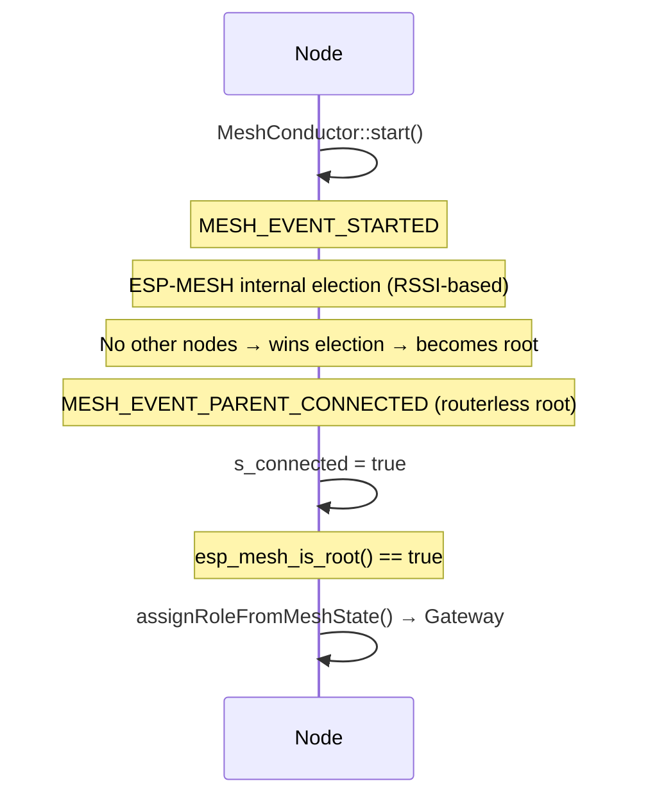
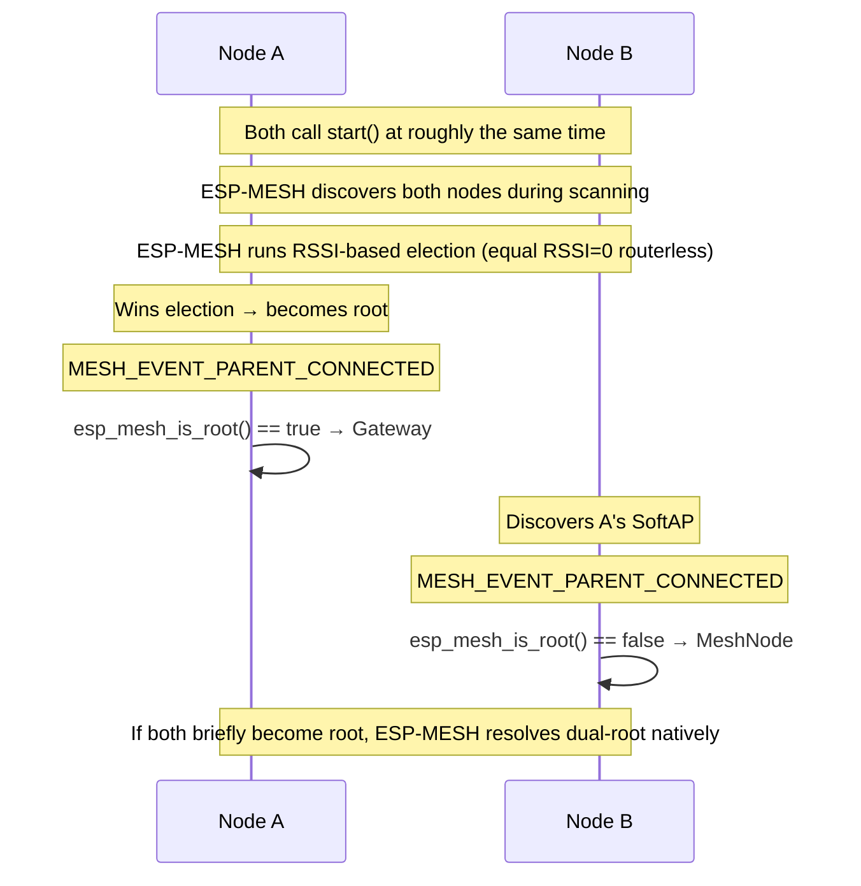
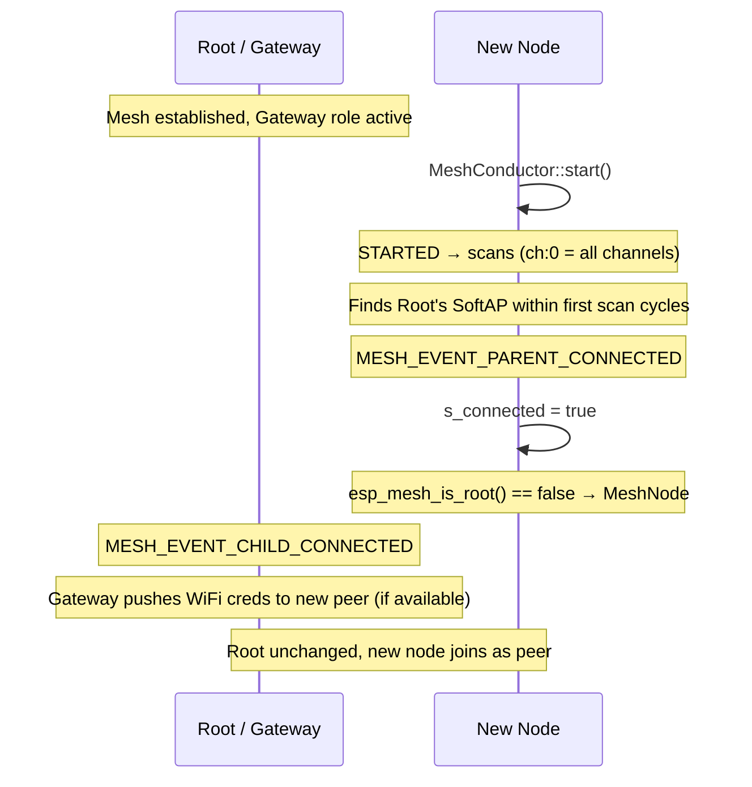
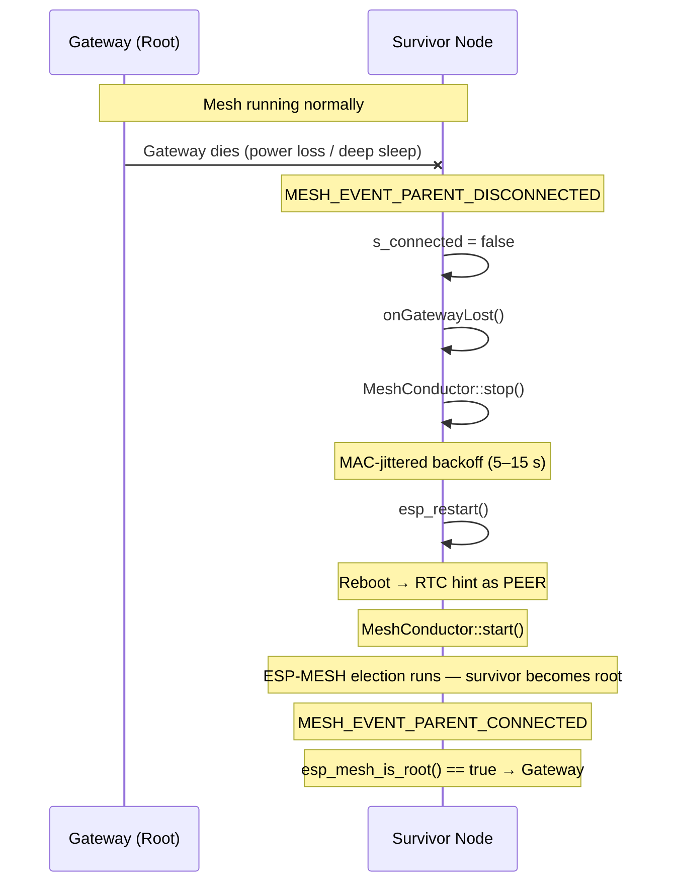
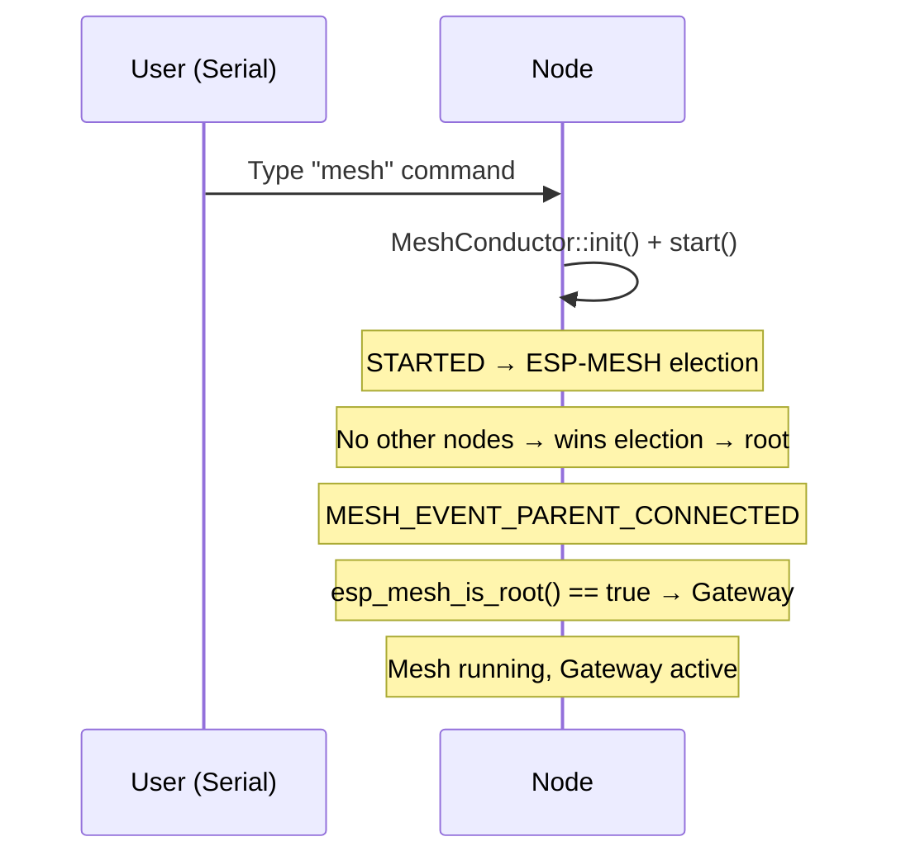

# Squeek — Functional Specification Document

## Context

Squeek is a pet toy and prank device built from a flotilla of identical ESP32-C6 SuperMini boards. The nodes form a self-healing WiFi mesh that uses FTM (Fine Timing Measurement) to determine their relative 3D positions without manual configuration. A smartphone or laptop controls the flotilla through a web UI served by the gateway node (whichever node is ESP-MESH root). The spatial awareness enables sounds to "travel" across the physical space — a cat chases a squeak that runs from node to node following the real room layout.

---

## 1. Overview

**Product:** Squeek — a distributed, self-locating sound mesh
**Target hardware:** ESP32-C6 SuperMini (ESP32-C6FH4, 4MB flash, WiFi 6, FTM, RISC-V)
**Framework:** PlatformIO, dual Arduino + ESP-IDF
**Nodes:** Identical firmware, scalable from 2 to N nodes

### Board Hardware (per SuperMini)
- ESP32-C6 SoC with WiFi 6 + FTM
- 4MB flash
- USB-C connector with built-in LiPo charger IC
- Charge state LED (managed by charger IC)
- WS2812 RGB LED on GPIO8
- Simple LED on GPIO15 via 1K resistor. Defaults to blink in debug, defaults to off in release.
- LiPo battery (user-supplied)
- Piezo buzzer driven push-pull via two GPIOs (user-soldered)
- Optional: voltage divider on GPIO2 or GPIO3 for battery ADC monitoring (user-soldered)

### Imported Arduino libraries
 -  `adafruit/Adafruit NeoPixel@^1.12` for WS2812 RGB LED
 -  `https://github.com/me-no-dev/AsyncTCP.git#master` for async TCP (used by ESPAsyncWebServer)
 -	`https://github.com/me-no-dev/ESPAsyncWebServer.git#master` for web server (dashboard + delegate wizard)
 -	`paulstoffregen/Time @ ^1.6.1` for NTP (future use)
 -  `bblanchon/ArduinoJson@^7` for JSON serialization (config, REST API, mesh messages)
 -	LEDC PWM + GPTimer for procedural tone synthesis (no external library)

### Pin Mapping (defined in `include/bsp.hpp`)
| Symbol | GPIO | Purpose |
|--------|------|---------|
| `LED_BUILTIN` | GPIO15 | Status LED (via 1K resistor) |
| `RBG_BUILTIN` | GPIO8 | WS2812 RGB LED |
| `BATTERY_ADC_PIN` | GPIO2 | Battery voltage ADC (via voltage divider) |
| `PIEZO_PIN_A` / `PIEZO_PIN_B` | GPIO22 / GPIO23 | Piezo buzzer (push-pull, opposed phases) |


**All app-centric preprocessor defines are made in `include/bsp.hpp`.**


### Primary Use Cases
- **Pet toy** for cats, ferrets, and small predators — sounds that travel, pop up randomly, or run in triggered sequences to stimulate hunting instincts
- **Prank device** — scheduled sound triggers with stealth mode that hides the mesh from discovery

### Key Differentiator
Nodes use WiFi FTM to build a 3D spatial map of the flotilla without any manual configuration. This drives intelligent sound routing — a "chase" sequence follows the actual physical layout, not an arbitrary order.

---

## 2. Functional Requirements

### FR1 — Self-Healing WiFi Mesh
- Nodes discover each other automatically on power-up
- Mesh reforms when nodes join, leave, or lose connectivity
- No manual pairing or configuration required
- All nodes run identical firmware

### FR2 — Gateway Role & WiFi Connectivity
- The ESP-MESH root node automatically becomes the Squeek Gateway (serves web UI, coordinates playback, schedules FTM)
- If the gateway goes offline, ESP-MESH promotes a new root; that node becomes gateway
- The gateway connects to a WiFi router as STA and serves the web UI on its router-assigned IP; the ESP-MESH SoftAP is invisible to phones (mesh-specific IEs)
- **Setup Delegate** pattern for first-time WiFi configuration: when the gateway has no stored WiFi credentials, it designates a peer (or itself if alone) to temporarily leave the mesh, run a `Squeek_Config_XXYY` SoftAP with a captive-portal WiFi wizard, collect credentials, reboot back into the mesh, and push credentials to the gateway via `MSG_TYPE_WIFI_CREDS`
- Battery rotation: gateway periodically calls `requestStepDown()` to voluntarily yield root, spreading battery drain across nodes (see Section 7.2)

### FR3 — FTM Self-Localization
- Nodes perform pairwise FTM ranging to estimate inter-node distances
- Gateway coordinates FTM round scheduling (non-overlapping pairs per round)
- Multiple samples per pair, averaged for precision
- Relative 3D Cartesian positions computed from distance matrix (MDS or iterative trilateration)
- Position map updates periodically; frequency configurable (battery vs. accuracy trade-off)
- Incremental updates: if a node moves, only its edges re-measured

### FR4 — Sound Playback
- **Tone synthesis** via LEDC PWM + GPTimer — procedural chirps, squeaks, warbles, melodies
- **Sample playback** (future) — compressed audio clips (MP3) decoded via libhelix-mp3, stored in LittleFS
- **Audio output layer is modular:**
  - Current: piezo buzzer, push-pull via two GPIOs (doubled voltage swing)
  - Future: I2S DAC companion board

### FR5 — Play Modes
- **Traveling sound** — sound hops across nodes following the physical 3D layout (spatial path computed by gateway)
- **Random pop-up** — random nodes emit sounds at random intervals
- **Triggered sequences** — user-defined patterns of (node, sound, delay) tuples launched from web UI
- **Scheduled triggers** — time-delayed or clock-based activation of the above 3 modes (for pranks or scheduled play times)

### FR6 — Web UI (served by gateway via router STA)
- Gateway connects to a WiFi router and serves the dashboard on its router-assigned IP (e.g., `http://192.168.1.92/`)
- Upload and manage sound samples
- Visualize node topology map in 3D (from FTM data)
- Design and trigger play sequences visually, taking advantage of the interactive 3D map as part of the UI to designate nodes and paths
- Configure play modes, scheduling, and FTM frequency
- Battery levels per node
- Stealth mode toggle
- Tab-based navigation

### FR7 — Stealth Mode
- Nodes stop advertising the WiFi SoftAP
- Web UI becomes inaccessible
- Only pre-scheduled or pre-configured sequences remain active
- Exit stealth via physical reset or a pre-set timeout

### FR8 — Visual Feedback
- WS2812 RGB LED for node status (mesh state, playback activity, low battery)
- GPIO15 LED as simple heartbeat indicator
- **LEDs must be kept brief** to conserve battery — flash and off, no sustained illumination

### FR9 — Battery Monitoring
- ADC reads battery voltage via high-impedance voltage divider on GPIO2 (`BATTERY_ADC_PIN`)
- Low-battery threshold triggers brief WS2812 warning color
- Critical-battery triggers graceful mesh departure and deep sleep
- Battery levels reported to gateway and visible in web UI

### FR10 — Node-Local Mesh Map
Each node maintains a local map of the mesh it belongs to, stored in two tiers:

**RTC Slow Memory (~8KB, survives light + deep sleep):**
- Own node ID, MAC, current role (gateway/peer)
- Gateway MAC, mesh channel, credentials
- Peer table: MAC + short ID for each known node (compact)
- Own 3D position (3 floats = 12 bytes)
- Last FTM epoch timestamp
- Mesh generation counter (detect stale data on wake)

**IRAM (full working map, when awake):**
- All peer 3D positions
- Full or partial distance matrix
- Peer status (awake/sleeping/dead/battery level)
- Current play sequence state + own role in it
- Routing hints (which peers to relay through)

---

## 3. Architecture

### System Topology

```
                    Controller
            (smartphone/laptop browser)
                       │
                  WiFi Router
                       │
              WiFi STA connection
                       ▼
    ┌──────────── Gateway Node ────────────────┐
    │ Web Server │ Coordinator │ FTM Scheduler │
    └──────────────────┬───────────────────────┘
             WiFi Mesh │ (ESP-MESH SoftAP, invisible to phones)
          ┌────────────┼────────────┐
          ▼            ▼            ▼
     ┌─────────┐  ┌─────────┐     ┌─────────┐
     │ Node A  │  │ Node B  │ ... │ Node X  │
     │     ◄───────── FTM ─────────────►    │
     └─────────┘  └─────────┘     └─────────┘
```

### Node Operating Modes

| Mode | WiFi | Power | Wake Trigger | Specific behavior
|------|------|-------|-------------|-----|
| **Deep Sleep** | Off | Minimal (~10uA) | Timer or GPIO only | Broadcasts its low battery states to MESH and goes back to sleep.
| **Light Sleep** | Maintained (DTIM beacon) | Low (~1-2mA) | WiFi packet from gateway, timer | Awaits for events to become idle/active again.
| **Idle** | Active, mesh participant | Medium | Immediate — already awake |  -na-
| **Active Play** | Active, low latency | Full | N/A — already in play mode | -na-

**Default state: Light Sleep.** Nodes wake briefly for mesh maintenance beacons, then return to sleep. Gateway wakes them via WiFi when needed for FTM rounds or play sequences.

### Firmware Layers (all nodes, identical firmware)

| Layer | Class / File | Responsibility |
|-------|-------------|---------------|
| **BSP** | `include/bsp.hpp` | Pin definitions, peripherals, board constants, power macros |
| **NvsConfigManager** | `nvs_config.h/cpp`, `property_value.h` | Persistent settings via NVS with auto-sync `PropertyValue<>` template, compile-time hash detection, factory reset |
| **LedDriver** | `led_driver.h/cpp` | Status + WS2812 RGB control, non-blocking blink task, master enable/disable |
| **PowerManager** | `power_manager.h/cpp` | Battery ADC (calibrated), low/critical thresholds, sleep wrappers (static class) |
| **RtcState** | `rtc_state.h/cpp` | Unified RTC state manager — mesh map + boot flags, `RTC_NOINIT_ATTR` with `esp_rom_crc32_le` CRC32 (survives soft resets, static class) |
| **MeshConductor** | `mesh_conductor.h/cpp`, `mesh_gateway.cpp`, `mesh_node.cpp`, `mesh_delegate.h/cpp` | WiFi mesh join/heal, root-observation role assignment, `IMeshRole` strategy (Gateway / MeshNode / Delegate), message routing, battery-based `requestStepDown()`, Setup Delegate WiFi wizard |
| **Localization Engine** | `ftm_manager.h/cpp`, `ftm_scheduler.h/cpp`, `position_solver.h/cpp`, `peer_table.h/cpp` | FTM round scheduling, distance matrix, 3D position solver (MDS + Kalman), PeerTable with heartbeat protocol |
| **Audio Engine** | `audio_engine.h/cpp`, `audio_tweeter.h/cpp`, `audio_i2s.h/cpp` (stub), `tone_library.h/cpp`, `sample_player.h/cpp` (stub) | Modular: LEDC PWM tone synthesis → abstract output (piezo driver now / I2S driver future); MP3 decode future |
| **Storage** | `storage_manager.h/cpp` | LittleFS: wizard HTML, dashboard assets, samples (future), config |
| **Orchestrator** | `orchestrator.h/cpp`, `clock_sync.h/cpp` | Play modes, sequence execution, mesh clock sync, scheduling |
| **Gateway Services** | `web_server.h/cpp` | Web server on gateway (served via router STA IP), REST API, WebSocket broadcast, dashboard assets |
| **NVS Config Registry** | `nvs_config_registry.h/cpp` | Remote config read/write on peer nodes via mesh messages (`MSG_TYPE_CONFIG_REQ/RESP`) |
| **Stealth & OTA** | `stealth_manager.h/cpp` (stub), `ota_manager.h/cpp` (stub) | Stealth mode (hide AP), OTA firmware updates |
| **Debug CLI** | `debug_cli.h/cpp` | Always-on serial CLI (FreeRTOS task), Tab-cycle command history, interactive tone player, orchestrator control |

### Node Lifecycle State Machine

```
BOOT → MESH_JOINING → LIGHT_SLEEP ←──────────────────┐
                           │                           │
                     [wake: beacon/timer]               │
                           ▼                           │
                      MESH_ACTIVE                      │
                       │       │                       │
              [FTM scheduled]  [play cmd]              │
                       ▼       ▼                       │
                 FTM_RANGING  ACTIVE_PLAY              │
                       │       │                       │
                  [done]   [sequence done]              │
                       └───────┴───────────────────────┘

GATEWAY (root node assumes this role):
  MESH_ACTIVE + SERVING_UI + FTM_COORDINATOR

STEALTH: like LIGHT_SLEEP but AP hidden,
         only pre-loaded schedules run

LOW_BATTERY → DEEP_SLEEP (timer-only wake for periodic check)
```

---

## 4. Software Stack

| Component | Library / API | Purpose |
|-----------|--------------|---------|
| Build system | PlatformIO + pioarduino platform | Dual Arduino + ESP-IDF |
| WiFi Mesh | ESP-IDF WiFi Mesh (`esp_mesh`) | Self-healing mesh network (native root election via `fix_root(false)`) |
| FTM | ESP-IDF FTM API (`esp_wifi_ftm`) | Pairwise ranging for localization |
| Audio synthesis | LEDC + GPTimer | Procedural tone generation (chirps, squeaks, warbles) |
| MP3 decode | chmorgan/esp-libhelix-mp3 (future) | Compressed sample playback (not yet integrated) |
| File system | joltwallet/littlefs | Wizard HTML, dashboard assets, config, samples (future) |
| LED | Adafruit NeoPixel (via GPIO8) | WS2812 RGB visual status feedback |
| Web server | ESPAsyncWebServer | REST API + WebSocket + static UI assets |
| JSON | bblanchon/ArduinoJson@^7 | API serialization, config, mesh messages |

---

## 5. Implementation Phases

### Phase 1 — Mesh & Blink  ✅ IMPLEMENTED
**Goal:** Two or more nodes form a self-healing mesh and prove it works.

- [x] WiFi mesh formation with auto-join (`MeshConductor::init/start`, ESP-IDF `esp_mesh`)
- [x] Gateway role — root-observation: ESP-MESH root automatically becomes Squeek Gateway; battery rotation via `requestStepDown()`
- [x] `IMeshRole` strategy pattern — `Gateway` and `MeshNode` concrete roles, swapped at runtime
- [x] LedDriver with non-blocking FreeRTOS blink task, HSV/RGB, master enable/disable
- [x] Battery voltage ADC via calibrated oneshot + voltage divider (`PowerManager`)
- [x] Light sleep between heartbeats (via `SQ_POWER_DELAY` macro, suppressed in debug builds)
- [x] RTC state manager with CRC32-protected mesh map and boot flags (`RtcState`, `RTC_NOINIT_ATTR` + `esp_rom_crc32_le`)
- [x] NvsConfigManager with `PropertyValue<>` auto-persistence, compile-time settings hash, factory reset
- [x] Debug CLI — always-on serial CLI with 19 text commands, Tab-cycle history, interactive tone player
- **Deliverable:** Scatter nodes, they find each other. Kill the gateway, another takes over. Serial CLI for hardware testing.

### Phase 2 — FTM Localization  ✅ IMPLEMENTED
**Goal:** Nodes know where they are in 3D space.

- [x] PeerTable (IRAM working map, 16-node capacity, heartbeat-driven)
- [x] Heartbeat protocol (`MSG_TYPE_HEARTBEAT`, 30s default, NVS-tunable)
- [x] Battery-aware step-down via `esp_mesh_waive_root()` with absolute threshold (cooldown `reelCd` 60s, hysteresis `batHyst` 300mV)
- [x] FtmManager (FTM initiator with 2σ outlier rejection)
- [x] FtmScheduler (priority queue, wake/ready/go state machine, anchor+incremental scheduling)
- [x] PositionSolver (classical MDS via power iteration + per-node diagonal Kalman filter, 1D/2D/3D adaptive)
- [x] Position data broadcast to all nodes via `MSG_TYPE_POS_UPDATE`
- [x] PeerSync broadcast (`MSG_TYPE_PEER_SYNC`) — gateway pushes peer table to all nodes
- [x] 10 new NVS parameters (heartbeat, step-down, FTM)
- [x] 7 new mesh message types (HEARTBEAT, FTM_WAKE/READY/GO/RESULT/CANCEL, POS_UPDATE, PEER_SYNC)
- **Deliverable:** Nodes report their 3D positions. Move one, positions update.

### Phase 3 — Audio Engine  ✅ VERIFIED
**Goal:** Every node can make sound.

- [x] LEDC PWM tone engine with push-pull piezo output on GPIO22/GPIO23
- [x] GPTimer ISR at 200 Hz for envelope interpolation (fixed-point, no floats)
- [x] Procedural tone library: 6 built-in tones (chirp, chirp_down, squeak, warble, alert, fade_chirp)
- [x] Segment-sequence format: `{freq_start, freq_end, duty_start, duty_end, duration_ms}`
- [x] Modular audio output interface (`IAudioOutput` — piezo driver now, I2S driver later)
- MP3 sample decode via libhelix → piezo output (future)
- LittleFS sample storage (upload via serial, future)
- **Deliverable:** Node plays a chirp on command via `tone` CLI command.

### Phase 4 — Orchestrator & Play Modes  ✅ IMPLEMENTED
**Goal:** Coordinated sound across the flotilla.

- [x] ClockSync — gateway broadcasts `millis()` offset at NVS-tunable interval; peers track offset for mesh-wide time
- [x] Orchestrator FreeRTOS task (4KB stack, tskIDLE+2) driven by event queue (depth 4)
- [x] **Travel mode** — gateway computes spatial path from PeerTable, sends `PlayCmdMsg` to each node in sequence; 3 sub-modes: nearest-neighbor (greedy via FTM distances), axis sweep (sort by X position), random permutation (Fisher-Yates)
- [x] **Random popup** — random alive node plays at random interval (NVS min/max bounds)
- [x] **Sequence mode** — user-defined `(node, tone, delay)` steps (max 32), NVS-persisted blob, loops on playback
- [x] **Scheduled triggers** — relative-delay one-shot FreeRTOS timer fires mode activation
- [x] 3 new mesh message types (`PLAY_CMD`, `ORCH_MODE`, `CLOCK_SYNC`) + packed structs
- [x] 6 new NVS keys (orchMode, orchTrvD, orchRMin, orchRMax, orchTone, csyncInt)
- [x] Gateway role transfer safety — `Gateway::end()` stops orchestration + clock sync; `Gateway::begin()` re-inits clock sync
- [x] CLI `orch` command with 12 sub-commands (travel, random, seq list/add/clear/save/load/play, sched, stop, status)
- **Deliverable:** Trigger "chase mode" — sound runs across nodes following physical layout.

### Phase 5 — Web UI  🔧 IN PROGRESS
**Goal:** Browser-based control from a phone.

**Phase 5A — Infrastructure (implemented):**
- [x] LittleFS for web assets (wizard.html.gz, dashboard.html.gz)
- [x] `SqWebServer` static class — ESPAsyncWebServer on gateway, REST API, WebSocket broadcast
- [x] DNS captive portal for delegate wizard (`SqWebServer::startDNS/stopDNS`)
- [x] `StorageManager` — LittleFS mount, gzip-transparent file serving

**Phase 5B — Setup Delegate & STA connectivity (implemented):**
- [x] `Delegate` role (`IMeshRole` implementation) — leaves mesh, runs `Squeek_Config_XXYY` SoftAP with WiFi wizard
- [x] WiFi scan → dropdown, connection test, credential save to NVS
- [x] Credential propagation: delegate → gateway (`MSG_TYPE_WIFI_CREDS`), gateway → all peers on join + broadcast
- [x] Credential ACK (`MSG_TYPE_WIFI_CREDS_ACK`) with early-exit in push loop
- [x] Button-triggered delegation — BOOT button (GPIO9) on gateway initiates scan contest + delegation (no automatic delegation)
- [x] Scan contest — `MSG_TYPE_SCAN_REQUEST` / `MSG_TYPE_SCAN_RESULT` — peers report visible SSID count, best peer becomes delegate
- [x] Delegate ticket — gateway tracks delegate MAC + monotonic `remaining_s` countdown (never rolls back, floors at zero)
- [x] Step-down suppression while delegate ticket is active; ticket transfer via `MSG_TYPE_DELEGATE_TICKET` / `MSG_TYPE_DELEGATE_TICKET_ACK` on gateway handoff
- [x] MAC-jittered backoff on gateway loss (5–15s), delegate reboot race fix
- [x] `cfg.channel = 1` for routerless bootstrap (fixed channel so all nodes converge); `cfg.channel = 0` on delegate return (scan all channels for existing mesh)
- [x] Fast-path boot from RTC state (GATEWAY/PEER/DELEGATE roles)
- [x] `MSG_TYPE_SETUP_DELEGATE` / `MSG_TYPE_DELEGATE_RESULT` / `MSG_TYPE_MERGE_CHECK`
- [x] WiFi scan filters out other `Squeek_Config_*` SSIDs
- [x] LED blinks 4x faster when a client connects to the delegate SoftAP

**Phase 5C — Dashboard (not started):**
- REST API: node list, position map, sound library, trigger play, upload samples
- Visual 3D topology map showing node positions (from FTM data)
- Sequence designer: build play patterns visually
- Schedule configuration
- Battery levels per node
- **Deliverable:** Connect phone to same WiFi as gateway, open browser at gateway IP, see the map, trigger a chase.

### Phase 6 — Stealth & Polish
**Goal:** Prank-ready, power-optimized, robust.

- Stealth mode: hide AP, disable web UI, run only pre-loaded schedules
- Stealth exit: physical reset or pre-set timeout
- Power tuning: optimize sleep intervals, LED durations, FTM frequency
- Low-battery graceful shutdown with mesh notification
- OTA firmware update via web UI
- **Deliverable:** Set a schedule, enable stealth, hide the nodes, wait for chaos.

---

## 6. Key Files

### Build & Configuration

| File | Purpose |
|------|---------|
| `platformio.ini` | Build config, dual Arduino + ESP-IDF framework, board definition, library deps |
| `sdkconfig.defaults` | ESP-IDF defaults (FreeRTOS tick, flash, Arduino autostart) |
| `sdkconfig.esp32c6-supermini` | Board-specific SDK config |
| `src/CMakeLists.txt` | ESP-IDF component registration — lists all 26 source files |

### Core Infrastructure (implemented)

| File | Purpose | Status |
|------|---------|--------|
| `include/bsp.hpp` | Pin definitions, hardware constants, version, power macros (`SQ_LIGHT_SLEEP`, etc.) | Done |
| `src/main.cpp` | Application entry point — init sequence, heartbeat loop | Done |
| `include/property_value.h` | `PropertyValue<nvsKey, T, Owner>` template — auto-persisting typed values with NVS write-through, `BeforeChangeFn` callback with override/cancel support | Done |
| `include/nvs_config.h` | `NvsConfigManager` class — compile-time `SETTINGS_HASH` (FNV-1a), default values, NVS keys | Done |
| `src/nvs_config.cpp` | NVS init, hash-mismatch detection, `restoreFactoryDefault()`, `reloadFromNvs()` | Done |
| `include/led_driver.h` | `LedDriver` static class — status + RGB LED API, `RgbColor` / `HsvColor` structs | Done |
| `src/led_driver.cpp` | FreeRTOS blink task, master enable/disable, HSV/RGB conversion, duty-cycle blinking | Done |
| `include/power_manager.h` | `PowerManager` static class — battery ADC, sleep wrappers | Done |
| `src/power_manager.cpp` | ADC oneshot with curve-fitting calibration, voltage divider math, sleep delegates | Done |
| `include/rtc_state.h` | `RtcState` static class + `rtc_state_t` struct — unified RTC state (mesh map + boot flags) | Done |
| `src/rtc_state.cpp` | CRC32 save/restore via `esp_rom_crc32_le`, `RTC_NOINIT_ATTR` storage (survives soft resets), init/clear/print | Done |
| `include/debug_cli.h` | Debug CLI entry point declaration | Done |
| `src/debug_cli.cpp` | Always-on serial CLI task, 19+ commands, Tab-cycle history, interactive tone player | Done |

### Phase 1 — Mesh & Role Assignment (implemented)

| File | Purpose | Status |
|------|---------|--------|
| `include/mesh_conductor.h` | `MeshConductor` static orchestrator, `IMeshRole` interface, `Gateway` / `MeshNode` classes | Done |
| `src/mesh_conductor.cpp` | WiFi mesh init, ESP-IDF mesh event handler, root-observation role assignment, mesh RX task, battery-based `requestStepDown()` | Done |
| `src/mesh_gateway.cpp` | `Gateway::begin/end/onPeerJoined/onPeerLeft/printStatus` — gateway role behavior | Done (Phase 1 stub, extended in Phase 5) |
| `src/mesh_node.cpp` | `MeshNode::begin/end/onPeerJoined/onPeerLeft/onGatewayLost` — peer role behavior | Done (Phase 1 stub) |

### Phase 2 — FTM Localization (implemented)

| File | Purpose | Status |
|------|---------|--------|
| `include/peer_table.h` / `src/peer_table.cpp` | IRAM peer map (16 nodes), heartbeat-driven, status flags | Done |
| `include/ftm_manager.h` / `src/ftm_manager.cpp` | FTM initiator with 2σ outlier rejection, session management | Done |
| `include/ftm_scheduler.h` / `src/ftm_scheduler.cpp` | Priority queue, wake/ready/go state machine, anchor+incremental scheduling | Done |
| `include/position_solver.h` / `src/position_solver.cpp` | Classical MDS via power iteration + per-node Kalman filter, 1D/2D/3D adaptive | Done |

### Phase 3 — Audio Engine (verified)

| File | Purpose | Status |
|------|---------|--------|
| `include/audio_engine.h` | `IAudioOutput` interface + `AudioEngine` sequencer class | Done |
| `src/audio_engine.cpp` | GPTimer ISR at 200 Hz, fixed-point envelope interpolation, play/stop API | Done |
| `include/audio_tweeter.h` | `PiezoDriver` class (LEDC push-pull on GPIO22/23) | Done |
| `src/audio_tweeter.cpp` | LEDC dual-channel complementary PWM driver | Done |
| `include/audio_i2s.h` | I2S DAC output driver (future) | Stub |
| `src/audio_i2s.cpp` | I2S configuration and DMA feed | Stub |
| `include/tone_library.h` | `ToneSegment`/`ToneSequence` structs, `ToneLibrary` static class | Done |
| `src/tone_library.cpp` | Built-in tone definitions (chirp, squeak, warble, alert, fade), lookup/list | Done |
| `include/sample_player.h` | MP3 sample decoder (libhelix) | Stub |
| `src/sample_player.cpp` | LittleFS read → MP3 decode → audio output | Stub |

### Phase 4 — Orchestrator (implemented)

| File | Purpose | Status |
|------|---------|--------|
| `include/orchestrator.h` | `Orchestrator` static class — `OrchMode`/`TravelOrder` enums, `SeqStep` struct, play mode coordinator | Done |
| `src/orchestrator.cpp` | FreeRTOS task + event queue, travel/random/sequence/scheduled modes, NVS blob persistence, spatial path builders | Done |
| `include/clock_sync.h` | `ClockSync` static class — gateway timer broadcast, peer offset tracking | Done |
| `src/clock_sync.cpp` | FreeRTOS software timer, `millis()` offset sync, `meshTime()` API | Done |

### Phase 5 — Web UI (partially implemented)

| File | Purpose | Status |
|------|---------|--------|
| `include/web_server.h` / `src/web_server.cpp` | Gateway web server (ESPAsyncWebServer on router STA IP), REST API, WebSocket broadcast, WiFi cred management, DNS captive portal | Done |
| `include/storage_manager.h` / `src/storage_manager.cpp` | LittleFS mount, gzip-transparent file serving | Done |
| `include/mesh_delegate.h` / `src/mesh_delegate.cpp` | `Delegate` role — WiFi wizard SoftAP (`Squeek_Config_XXYY`), scan, connect, credential save | Done |
| `include/nvs_config_registry.h` / `src/nvs_config_registry.cpp` | Remote NVS config read/write on peer nodes via `MSG_TYPE_CONFIG_REQ/RESP` | Done |
| `web/dashboard/` | Dashboard HTML/JS/CSS source (future) | Stub |

### Phase 6 — Stealth & Polish (stub)

| File | Purpose | Status |
|------|---------|--------|
| `include/stealth_manager.h` | Stealth mode — hide AP, schedule-only operation | Stub |
| `src/stealth_manager.cpp` | AP visibility control, stealth timer, exit conditions | Stub |
| `include/ota_manager.h` | OTA firmware update | Stub |
| `src/ota_manager.cpp` | OTA manifest check, download, flash, reboot | Stub |

---

## 7. Class Architecture Notes

All major subsystem classes use the **static class** pattern: deleted constructor, all-static public API, file-scope state in the `.cpp` file. This avoids singleton boilerplate while keeping state encapsulated.

### 7.1 NvsConfigManager & PropertyValue

`NvsConfigManager` owns all persistent user-facing settings. Each setting is a `PropertyValue<nvsKey, T, Owner>` instance — a typed wrapper that auto-persists to NVS on assignment and restricts write access to the `friend Owner` class.

**Key mechanisms:**

- **Auto-persistence:** `PropertyValue::operator=` writes the new value to NVS and commits immediately. The `loadInitial()` private method bypasses both NVS write-back and the callback (used only during startup load from NVS).

- **`BeforeChangeFn` callback:** `void(*)(T oldValue, T newValue, T* override, bool* cancel)` — fires before a value change is stored. The callback can:
  - Inspect the old and proposed new values
  - Modify `*override` to substitute a different value
  - Set `*cancel = true` to abort the change entirely
  - Trigger side effects in other subsystems (e.g., `LedDriver::setEnabled()`)

- **`settingHash` (private):** A compile-time FNV-1a hash (`SETTINGS_HASH`) computed over all members' default values. On boot, `begin()` reads the stored hash from NVS. If absent or mismatched (meaning firmware defaults changed since last flash), `restoreFactoryDefault(0xBEEFF00D)` is called to overwrite ALL NVS-backed members with their compile-time defaults.

- **`restoreFactoryDefault(uint32_t safeKey)`:** Resets every member to its default and writes them to NVS. The `safeKey` must equal `0xBEEFF00D` or the call is a no-op. This safety guard prevents accidental invocation.

- **Adding a new setting** requires:
  1. An `inline constexpr char NVS_KEY_xxx[]` and a `DEFAULT_xxx` constant in `nvs_config.h`
  2. One more `fnv*` line in `detail::computeSettingsHash()`
  3. A `static PropertyValue<...>` member in `NvsConfigManager`
  4. One `loadInitial()` line in `reloadFromNvs()`
  5. One assignment line in `restoreFactoryDefault()`

**Current members:**

| Member | Type | NVS Key | Default | Phase | Purpose |
|--------|------|---------|---------|-------|---------|
| `settingHash` | `uint64_t` | `"sHash"` | `SETTINGS_HASH` | 1 | Compile-time defaults fingerprint (**private**) |
| `ledsEnabled` | `bool` | `"ledsEn"` | `true` | 1 | Master LED enable/disable; LedDriver obeys via `BeforeChangeFn` |
| `colorInit` | `uint32_t` | `"clrInit"` | `0x00140600` | 1 | Boot-blink LED color (dim orange) |
| `colorReady` | `uint32_t` | `"clrRdy"` | `0x00140F00` | 1 | Init-done LED color (dim yellow) |
| `colorGateway` | `uint32_t` | `"clrGw"` | `0x00000008` | 1 | Gateway heartbeat LED color (dim blue) |
| `colorPeer` | `uint32_t` | `"clrPeer"` | `0x00000800` | 1 | Connected peer heartbeat LED color (dim green) |
| `colorDisconnected` | `uint32_t` | `"clrDisc"` | `0x00200000` | 1 | Disconnected heartbeat LED color (dim red) |
| `heartbeatInterval_s` | `uint32_t` | `"hbInt"` | `30` | 2 | Heartbeat interval (seconds) |
| `heartbeatStaleMultiplier` | `uint32_t` | `"hbStale"` | `3` | 2 | Missed heartbeats before peer marked stale |
| `reelectionCooldown_s` | `uint16_t` | `"reelCd"` | `60` | 2 | Minimum seconds between step-down attempts |
| `batteryHysteresis_mv` | `uint16_t` | `"batHyst"` | `300` | 2 | Battery recovery hysteresis above `BATTERY_LOW_MV` before clearing waived flag |
| `ftmStaleness_s` | `uint32_t` | `"ftmStale"` | `300` | 2 | FTM data staleness threshold (seconds) |
| `ftmNewNodeAnchors` | `uint32_t` | `"ftmAnch"` | `5` | 2 | Anchor FTM rounds for new nodes |
| `ftmSamplesPerPair` | `uint32_t` | `"ftmSamp"` | `8` | 2 | FTM samples per pair |
| `ftmPairTimeout_ms` | `uint32_t` | `"ftmTmo"` | `3000` | 2 | FTM pair timeout (ms) |
| `ftmSweepInterval_s` | `uint32_t` | `"ftmSwp"` | `600` | 2 | FTM full sweep interval (seconds) |
| `ftmKalmanProcessNoise` | `float` | `"ftmKpn"` | `0.01` | 2 | Kalman filter process noise for FTM |
| `ftmResponderOffset_cm` | `uint32_t` | `"ftmOfs"` | `0` | 2 | FTM responder offset calibration (cm) |
| `orchMode` | `uint32_t` | `"orchMode"` | `0` | 4 | Orchestrator play mode (0=off) |
| `orchTravelDelay_ms` | `uint32_t` | `"orchTrvD"` | `500` | 4 | Delay between travel hops (ms) |
| `orchRandomMin_ms` | `uint32_t` | `"orchRMin"` | `3000` | 4 | Random popup minimum interval (ms) |
| `orchRandomMax_ms` | `uint32_t` | `"orchRMax"` | `15000` | 4 | Random popup maximum interval (ms) |
| `orchToneIndex` | `uint32_t` | `"orchTone"` | `0` | 4 | Default tone index for orchestrator |
| `clockSyncInterval_s` | `uint32_t` | `"csyncInt"` | `10` | 4 | Clock sync broadcast interval (seconds) |
| `webEnabled` | `bool` | `"webEn"` | `true` | 5 | Web server enable/disable |
| `fastScanDelay_s` | `uint16_t` | `"fastScn"` | `5` | 5 | Fast-boot scan delay before self-promotion (seconds) |
| `delegateTimeout_s` | `uint16_t` | `"dlgTmo"` | `240` | 5 | Delegate watchdog timeout (seconds, clamped 60–600) |
| ~~`scanContestTimeout_s`~~ | — | — | — | — | *Removed — scan contest timeout hardcoded to 10s in `mesh_gateway.cpp`* |

**Supported `PropertyValue` types:** `bool`, `uint16_t`, `uint32_t`, `uint64_t`, `float` (stored as bit-cast `uint32_t` in NVS).

### 7.2 MeshConductor — Root-Observation Role Assignment

The Squeek Gateway role is assigned by observing ESP-MESH root status — whichever node is the mesh root automatically becomes the Gateway. There is no overlay election protocol.

**Role assignment rules:**
- When a node becomes root (`esp_mesh_is_root()` returns true), `MeshConductor` assigns it the Gateway role.
- When a node loses root status, it transitions to the MeshNode (peer) role.
- On gateway loss, ESP-MESH's internal root recovery promotes a new root; that node becomes Gateway.
- `fix_root(false)` (default) — ESP-MESH handles root election and dual-root resolution natively using RSSI-based voting. Root changes are triggered voluntarily via `esp_mesh_waive_root()`.

**Battery rotation (absolute threshold + "hot potato" waiving):**
The gateway monitors its own battery via `PeerTable::checkReelection()`. When gateway battery drops below `BATTERY_LOW_MV` (3300 mV) and at least one alive peer has NOT set the `PEER_STATUS_WAIVED` flag in its heartbeat, the gateway:
1. Sets `waived_low_battery = 1` in RTC state
2. Calls `MeshConductor::requestStepDown()` → `stepDown()` → `esp_mesh_waive_root(NULL, MESH_VOTE_REASON_ROOT_INITIATED)`
3. ESP-MESH fires `MESH_EVENT_ROOT_SWITCH_REQ` → `assignRoleFromMeshState()` detects role mismatch → reboot as PEER

The waived node advertises `PEER_STATUS_WAIVED` in its heartbeat flags, so the new gateway knows not to waive back to it. If ALL peers are waived, the current gateway stays alive (last-standing). Battery recovery clears the waived flag when battery exceeds `BATTERY_LOW_MV + batteryHysteresis_mv` (default 300 mV).

### 7.2.1 Mesh Timing Scenarios

Sequence diagrams for the mesh lifecycle. With `fix_root(false)`, ESP-MESH handles root election natively. However, routerless bootstrap requires a safety-net **bootstrap timer**: a MAC-based deterministic delay (5–30s via FNV-1a hash of STA MAC) started at `esp_mesh_start()`. If no parent is found before the timer fires, the node self-elects as root via `esp_mesh_set_type(MESH_ROOT)`. The lowest-MAC node wins the race deterministically. All routerless nodes use fixed channel 1 so they converge on the same frequency.

Key constants (from `bsp.hpp`): `MESH_REELECT_SLEEP_MS` = 5 s.

#### Scenario 1 — Single Node Boot


```mermaid
sequenceDiagram
    participant N as Node

    N->>N: MeshConductor::start()
    Note over N: MESH_EVENT_STARTED
    Note over N: ESP-MESH internal election (RSSI-based)
    Note over N: No other nodes → wins election → becomes root
    Note over N: MESH_EVENT_PARENT_CONNECTED (routerless root)
    N->>N: s_connected = true
    Note over N: esp_mesh_is_root() == true
    N->>N: assignRoleFromMeshState() → Gateway
```

#### Scenario 2 — Simultaneous Two-Node Boot


```mermaid
sequenceDiagram
    participant A as Node A
    participant B as Node B

    Note over A,B: Both call start() at roughly the same time
    Note over A,B: ESP-MESH discovers both nodes during scanning
    Note over A,B: ESP-MESH runs RSSI-based election (equal RSSI=0 routerless)
    Note over A: Wins election → becomes root
    Note over A: MESH_EVENT_PARENT_CONNECTED
    A->>A: esp_mesh_is_root() == true → Gateway
    Note over B: Discovers A's SoftAP
    Note over B: MESH_EVENT_PARENT_CONNECTED
    B->>B: esp_mesh_is_root() == false → MeshNode
    Note over A,B: If both briefly become root, ESP-MESH resolves dual-root natively
```

#### Scenario 3 — Late Joiner (mesh already running)


```mermaid
sequenceDiagram
    participant R as Root / Gateway
    participant N as New Node

    Note over R: Mesh established, Gateway role active
    N->>N: MeshConductor::start()
    Note over N: STARTED → scans (ch:0 = all channels)
    Note over N: Finds Root's SoftAP within first scan cycles
    Note over N: MESH_EVENT_PARENT_CONNECTED
    N->>N: s_connected = true
    Note over N: esp_mesh_is_root() == false → MeshNode
    Note over R: MESH_EVENT_CHILD_CONNECTED
    Note over R: Gateway pushes WiFi creds to new peer (if available)
    Note over R,N: Root unchanged, new node joins as peer
```

#### Scenario 4 — Gateway Loss + Root Recovery


```mermaid
sequenceDiagram
    participant G as Gateway (Root)
    participant S as Survivor Node

    Note over G,S: Mesh running normally
    G-xS: Gateway dies (power loss / deep sleep)
    Note over S: MESH_EVENT_PARENT_DISCONNECTED
    S->>S: s_connected = false
    S->>S: onGatewayLost()
    S->>S: MeshConductor::stop()
    Note over S: MAC-jittered backoff (5–15 s)
    S->>S: esp_restart()
    Note over S: Reboot → RTC hint as PEER
    Note over S: MeshConductor::start()
    Note over S: ESP-MESH election runs — survivor becomes root
    Note over S: MESH_EVENT_PARENT_CONNECTED
    Note over S: esp_mesh_is_root() == true → Gateway
```

> With multiple survivors, the MAC-based jitter (5–15 s) staggers reboots. ESP-MESH's native election picks a new root; others discover its SoftAP during their post-reboot scan and join as peers.

#### Scenario 5 — Debug Menu (Mesh Join)


```mermaid
sequenceDiagram
    participant U as User (Serial)
    participant N as Node

    U->>N: Type "mesh" command
    N->>N: MeshConductor::init() + start()
    Note over N: STARTED → ESP-MESH election
    Note over N: No other nodes → wins election → root
    Note over N: MESH_EVENT_PARENT_CONNECTED
    Note over N: esp_mesh_is_root() == true → Gateway
    Note over N: Mesh running, Gateway active
```

#### Scenario 6 — Setup Delegate (button-triggered WiFi configuration)

Delegation is **manually triggered** by pressing the BOOT button (GPIO9) on the gateway node. There is no automatic delegation — the mesh forms first, the user decides when to initiate WiFi setup.

**BOOT button behavior:**
- **GATEWAY role active:** initiate delegation — scan contest among peers, best peer becomes delegate
- **Otherwise:** ignored (ESP-MESH handles root election natively)

**Scan contest:** When the gateway receives a BOOT button press:
1. Gateway broadcasts `MSG_TYPE_SCAN_REQUEST` to all peers
2. Each peer performs a WiFi scan (`esp_wifi_scan_start()`) and reports back `MSG_TYPE_SCAN_RESULT` {mac, ssid_count} to gateway
3. Gateway collects results (10 s timeout), picks the peer with the most visible SSIDs (best radio position for reaching a router)
4. Gateway creates a *delegate ticket* (winner MAC + `remaining_s` countdown) and sends `MSG_TYPE_SETUP_DELEGATE` to the winner

If the gateway has no peers (lone node), the button press triggers self-delegation: the gateway sets `next_role = DELEGATE` in RTC and reboots.

**Delegate ticket:** Tracks the delegate's MAC and a monotonically decreasing countdown (`remaining_s`, initialized from `delegateTimeout_s` NVS param, default 240 s). The countdown is decremented locally by whoever holds the ticket and **never rolls back** — once it reaches zero, it stays at zero until the gateway acts on it.

**Step-down suppression:** While a delegate ticket is active (`remaining_s > 0`), `requestStepDown()` is suppressed. If root changes anyway (e.g., crash), the outgoing gateway sends the ticket to the new gateway via `MSG_TYPE_DELEGATE_TICKET` as a point-to-point **transfer of powers** during the role transition. The new gateway inherits the ticket and continues the countdown.

**Ticket transfer protocol:** When root changes and the new root differs from the current gateway:
1. Old gateway sends `MSG_TYPE_DELEGATE_TICKET` (delegate MAC + `remaining_s`) to new gateway
2. New gateway ACKs with `MSG_TYPE_DELEGATE_TICKET_ACK`
3. Old gateway steps down to MeshNode
4. New gateway begins its term with the inherited ticket

If the old gateway crashes before transferring, the delegate eventually times out (watchdog), reboots, rejoins the mesh, and delivers creds normally.

**Delegation flow (multi-node):**

1. User presses BOOT button on the gateway node
2. Gateway broadcasts `MSG_TYPE_SCAN_REQUEST` to all peers
3. Each peer runs `esp_wifi_scan_start()`, counts visible SSIDs
4. Each peer sends `MSG_TYPE_SCAN_RESULT` {mac, ssid_count} back to gateway
5. Gateway waits up to 10 s, then picks the peer with the highest ssid_count
6. Gateway creates delegate ticket (winner MAC, `remaining_s` = 240)
7. Gateway sends `MSG_TYPE_SETUP_DELEGATE` to the winner — step-down now suppressed
8. Winner sets `next_role = DELEGATE` in RTC, reboots into Delegate role
9. Delegate starts SoftAP `Squeek_Config_XXYY`, captive portal, 240 s watchdog
10. User connects phone to the SoftAP, enters WiFi credentials via wizard
11. Delegate tests router connection, saves creds to NVS
12. Delegate tears down SoftAP (deauths phone first, then STA disconnect — order matters to avoid `(tx)rts error` spam), reboots as Peer with `delegate_active=1` in RTC
13. Peer suppresses router creds in mesh config (`delegate_active` flag), sets `cfg.channel=0` (scan all channels) — rejoins the existing mesh wherever it is
14. Peer pushes `MSG_TYPE_WIFI_CREDS` to gateway (retry loop: 10 attempts, 3s apart, early-exit on ACK). Gateway sends `MSG_TYPE_WIFI_CREDS_ACK` back to sender via `sendToNode(from.addr)` (not `sendToRoot()` — root would loopback to itself)
15. If mesh disconnects mid-push, `delegate_active` stays set in RTC — next boot retries. Only cleared on confirmed ACK
16. Gateway saves creds to NVS, broadcasts to all peers, then reboots after 2s delay (timer-deferred `esp_restart()` — `esp_mesh_set_config()` is unreliable at runtime). On reboot, gateway loads creds, connects to router, mesh reforms on router's channel. Children lose gateway, backoff-reboot, rejoin on router's channel with creds from their own NVS

**Delegation flow (lone gateway):**

1. User presses BOOT button — gateway has no peers
2. Gateway self-delegates: sets `next_role = DELEGATE` in RTC, reboots
3. Steps 9–13 above, except the delegate IS the former gateway

> **Lone gateway:** If the gateway has no peers, the BOOT button press triggers self-delegation (sets `next_role = DELEGATE` in RTC and reboots). **Fallback strategy:** If WiFi scanning on mesh nodes proves unreliable (netif conflicts), the scan contest can be replaced by selecting the peer with the strongest RSSI to the root (already known from the mesh layer).

### 7.3 LedDriver

`LedDriver` manages both the GPIO15 status LED and the WS2812 RGB LED through a unified static API with a FreeRTOS background blink task.

**Key mechanisms:**

- **Master enable/disable:** `setEnabled(bool)` controlled by `NvsConfigManager::ledsEnabled` via a `BeforeChangeFn` callback. When disabled, all "turn on" API calls are silently ignored (except off commands), and both LEDs are forced off. Blink configuration is preserved so blinking resumes automatically on re-enable.

- **Guard strategy:** Direct-write methods (`statusOn`, `statusFlash`, `rgbSet`) check `s_ledsEnabled` and early-return. Config-only methods (`statusBlink`, `rgbBlink`) store parameters freely. The blink task has its own master kill-switch at the top of the loop. Off methods are never guarded.

- **Blink task:** A single FreeRTOS task handles both LEDs with independent period/duty-cycle timers. The task is suspended when no blinking is active and resumed on demand via `assetLedDriverTaskState()`.

---

## 8. Open Questions

1. ~~**Piezo GPIO assignment**~~ — Resolved: GPIO22 (`PIEZO_PIN_A`) + GPIO23 (`PIEZO_PIN_B`), defined in `bsp.hpp`.
2. ~~**Battery ADC GPIO**~~ — Resolved: GPIO2 (`BATTERY_ADC_PIN`), defined in `bsp.hpp`.
3. ~~**ESP-IDF WiFi Mesh vs ESP-NOW**~~ — Resolved: using `esp_mesh` (ESP-IDF WiFi Mesh) with native root election (`fix_root(false)`). Implemented in `MeshConductor`.
4. ~~**Mozzi on ESP32-C6**~~ — Resolved: Mozzi incompatible with ESP32-C6 single-core RISC-V (watchdog resets). Replaced with LEDC PWM + GPTimer.
5. ~~**Web UI framework**~~ — Resolved: ESPAsyncWebServer + vanilla HTML/JS served from LittleFS (gzip-compressed).
6. **FTM accuracy in practice** — Real-world testing needed to calibrate expectations for 3D positioning.
7. **Max sample storage** — How much flash to allocate for uploaded MP3 samples after firmware + UI assets?
8. **Multi-AP WiFi credential storage** — Currently using custom NVS keys for a single SSID/password. Espressif's built-in WiFi credential NVS storage supports multiple known routers — should we migrate?

---

## Appendix A — Debug CLI

An always-on serial CLI for in-situ hardware and firmware testing. Runs as a FreeRTOS task alongside normal firmware operation (non-blocking). Replaces the old numbered debug menu.

### A.1 Activation Mechanism

- `#define DEBUG_MENU_ENABLED` declared in `include/bsp.hpp`
- When defined, `setup()` calls `debug_cli_init()` which spawns the CLI task
- When undefined, the CLI code is excluded from compilation entirely (`#ifdef` guard)

### A.2 CLI Features

- **Always-on:** CLI runs concurrently with mesh, audio, and all other subsystems
- **Command history:** Tab cycles through the last 3 successful commands (most recent first, wraps to empty)
- **Interactive modes:** Some commands (e.g., `tone`) enter a sub-mode with single-keypress interaction; `.` or DEL exits back to the CLI prompt

### A.3 Command Reference

| Command | Description |
|---------|-------------|
| `help` | List all commands |
| `led` | Blink status LED + RGB R/G/B test |
| `battery` | Read battery voltage and status |
| `wifi` | Scan nearby APs |
| `mesh` | Join mesh, show peers, then stop |
| `elect` | Waive gateway role — ESP-MESH re-elects (`esp_mesh_waive_root()`) |
| `rtc` | RTC memory write/readback test |
| `sleep [N]` | Light sleep for N seconds (default 5) |
| `peers` | Show PeerTable (synced from gateway) |
| `tone` | Interactive tone player — ASCII numpad, keys 1-6 play tones, 0 stops, `.` quits |
| `config` | Get/set NVS config locally or on peers (`config list`, `config get`, `config set`) |
| `mode` | Step down from gateway: `mode peer` |
| `ftm` | FTM single-shot to first peer |
| `sweep` | FTM full sweep, print distance matrix |
| `solve` | Run MDS position solver |
| `broadcast` | Broadcast positions to all nodes |
| `quiet` | Toggle background output suppression |
| `status` | Print mesh state, role, battery, peers |
| `orch` | Orchestrator control: `travel`, `random`, `seq`, `sched`, `stop`, `status` |
| `reboot` | Reboot (`esp_restart`) |

### A.4 Tone Player Sub-Mode

Entering `tone` displays an ASCII numpad and reads single keypresses:

```
┌───────┬───────┬───────┐
│ 7     │ 8     │ 9     │
│  ---  │  ---  │  ---  │
├───────┼───────┼───────┤
│ 4     │ 5     │ 6     │
│warble │ alert │ fade  │
│       │       │ chirp │
├───────┼───────┼───────┤
│ 1     │ 2     │ 3     │
│ chirp │ chirp │ squeak│
│       │ down  │       │
├───────┴───────┼───────┤
│     0 = stop  │ . quit│
└───────────────┴───────┘
```

Keys 7-9 are reserved for future tones. Pressing a tone key replaces any currently playing tone.

### A.5 Implementation Notes

- The CLI lives in `src/debug_cli.cpp` / `include/debug_cli.h`
- Serial baud rate: 115200 (matches `platformio.ini` `monitor_speed`)
- **Sleep is incompatible with debugging.** When `DEBUG_MENU_ENABLED` is defined, all sleep modes (light sleep, deep sleep) must be disabled. A sleeping node kills Serial output, JTAG, and makes interactive debugging impossible. Sleep integration is only tested and enabled in release builds (i.e. when `DEBUG_MENU_ENABLED` is not defined).
- **Power macros replace raw sleep/delay calls.** All power-saving sleeps and related timeouts must use the following macros (defined in `include/bsp.hpp`), never raw `esp_light_sleep_start()`, `esp_deep_sleep()`, or `delay()` for power-saving purposes:
  - `SQ_LIGHT_SLEEP(duration_ms)` — enters light sleep in release; becomes `delay(duration_ms)` when `DEBUG_MENU_ENABLED` is defined (keeps Serial and JTAG alive).
  - `SQ_DEEP_SLEEP(duration_ms)` — enters deep sleep in release; becomes `delay(duration_ms)` + a Serial warning when `DEBUG_MENU_ENABLED` is defined (prevents bricking the debug session).
  - `SQ_POWER_DELAY(duration_ms)` — a power-budget delay (e.g., idle interval between mesh beacons). Same `delay()` in both modes, but exists as a distinct macro so power-tuning passes can find and adjust these values without touching functional delays.

  This keeps sleep policy in one place and avoids littering the codebase with `#ifdef DEBUG_MENU_ENABLED` guards around every sleep call.
